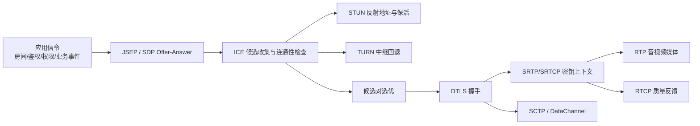
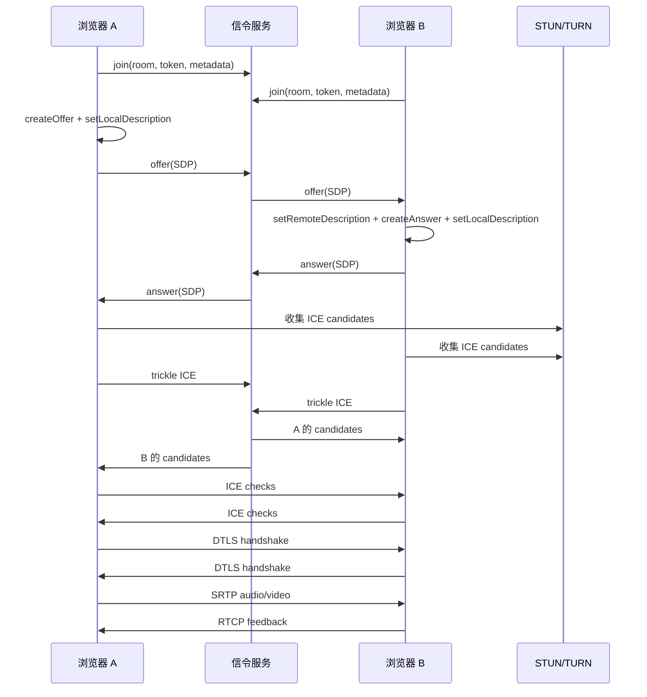
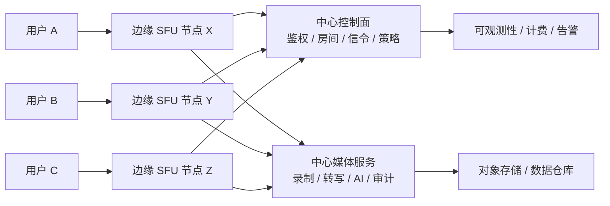
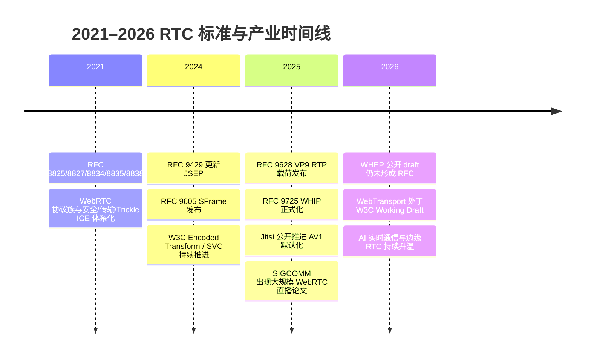
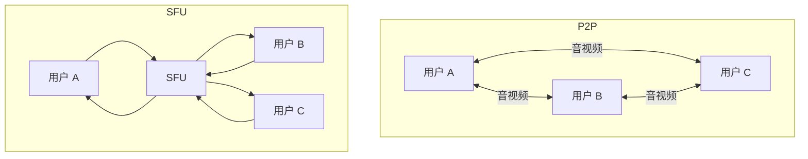
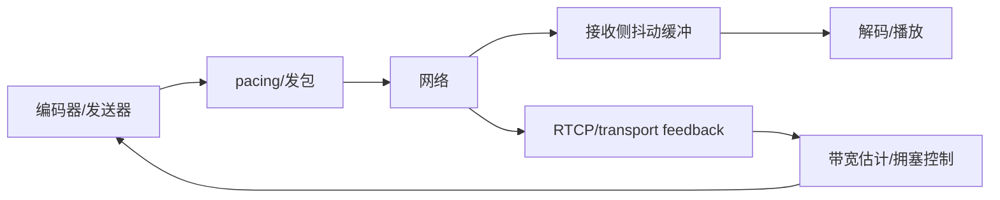

# RTC 实时通信核心技术、理论与行业发展分析报告暨课堂教学素材包

## 执行摘要

实时通信系统不是“浏览器 API + 几个信令消息”这么简单，而是一个由采集、预处理、编码、传输、拥塞控制、解码、同步、渲染、统计观测和安全机制共同组成的闭环系统。今天工程上最成熟的 Web 端路线，仍然是以 WebRTC 作为浏览器侧统一接口，以 RTP/RTCP/SRTP 传输媒体，以 ICE/STUN/TURN 解决公网连通性，以 DTLS/DTLS-SRTP 建立安全上下文；与此同时，应用层信令、房间控制、鉴权、录制、转写、AI 处理、跨区域调度等能力通常并不由 WebRTC 规范统一定义，而是由业务系统自己实现。citeturn7view1turn22view5turn22view0turn21view0turn22view1turn34search7

从近五年的标准演进看，RTC 生态在 2021 年形成了一批成体系的 IETF 标准文档，随后在 2024—2026 年继续扩展：JSEP 在 2024 年由 RFC 9429 更新，SFrame 在 2024 年形成 RFC 9605，VP9 的 RTP 载荷格式在 2025 年发布为 RFC 9628，WHIP 在 2025 年成为 RFC 9725，而 WHEP 截至 2026 年 4 月仍处于公开 Internet-Draft 流程中，公开页面显示 draft-ietf-wish-whep-03 已于 2026 年 2 月 19 日过期。与此同时，entity["organization","W3C","web standards body"] 的 WebRTC、WebRTC Stats、Encoded Transform、Media Capture 和 WebTransport 仍在持续推进，使“浏览器原生实时媒体”从基础通话扩展到端到端加密、脚本可编程媒体处理、分层编码和更通用的 QUIC 数据传输。citeturn24search1turn25search1turn0search4turn23view0turn23view1turn7view1turn7view0turn7view2turn7view4turn7view3

工程实践的主流架构选择也已经比较清晰：1 对 1 或极少参与者时，P2P 仍然最低成本；多方会议和互动场景下，SFU 是主流；当终端极弱、需要统一单路输出或传统会议/语音系统兼容时，MCU 仍然有价值；而全球业务越来越倾向于“边缘 SFU + 中心控制面 + 可选中心媒体服务”的混合型平台。开源与商业两侧都在向这个方向靠拢：mediasoup 明确把 SFU 定位为接收多路流并按需选择空间/时间层转发；Jitsi Videobridge 把自己定义为 WebRTC 兼容的 SFU/多媒体路由器；entity["company","LiveKit","realtime platform"] 在官方文档中区分了 single-home SFU 和 global mesh SFU；entity["company","Cloudflare","edge network provider"] 则明确把其 Realtime 能力描述为分布式实时数据平面和“无区域”的全球 SFU；entity["company","Twilio","communications platform"] 公开说明其 Group Rooms 使用基于 SFU 的媒体服务器并通过带宽分配 API、VP8 Simulcast 与轨道优先级保护音频与 UI 关键视频。citeturn26view4turn26view6turn26view0turn26view1turn26view2turn26view3

行业最新变化不只体现在基础设施，还体现在编解码与 AI 方向。浏览器和移动 RTC 侧，AV1 的工程可行性显著提高：Chrome 官方在 2023 年公开强调 WebRTC 中 AV1 编码速度和压缩效率的改进，Meta 在 2024 年专门分享了在移动 RTC 中使用 AV1 的实践与低带宽画质收益、CPU/电池和稳定性挑战，Jitsi 在 2024 年公开宣布将 AV1 作为默认视频编解码方向之一。另一方面，RTC 正快速与 AI 融合：LiveKit Cloud 的官方定位已经转向“构建与托管 AI agent 的全托管全球化平台”，HotNets 2025 甚至把“人与 AI 的实时视频通话”作为新的 RTC 范式提出。entity["company","Meta","social technology company"] 还在 2024 年公开了基于机器学习优化 RTC 带宽估计的方案，表明“经验调参”正在向“模型辅助网络适配”演化。citeturn12search0turn13search3turn14search4turn1search3turn4search7turn13search4

这份报告的核心结论是：**RTC 的难点已经从“能否建立连接”转向“如何在多目标约束下稳定交付体验”**。这些目标包括低时延、弱网鲁棒性、带宽公平、功耗、隐私、可观测性、全球部署成本，以及对直播、AI、边缘和新传输形态的适配。下面的正文会从理论、协议、实现、测试、安全、部署、产业与教学八个方面展开，并给出一套可直接用于课堂与实验的完整中文材料。citeturn22view5turn23view2turn27view5turn27view6turn7view0turn7view2

## 核心技术、理论与协议栈

RTC 的首要理论基础是对**时延、抖动、同步、QoS/QoE**的区分。RTP 从设计上就服务于实时数据，它提供序号、时间戳、负载类型标识和 RTCP 监测，但并不保证 QoS，也不提供资源预留；这意味着在公网 UDP 环境里，真正决定体验的往往不是“有没有 RTP”，而是上层如何围绕 RTP/RTCP 做编码自适应、抖动缓冲和拥塞控制。W3C 的 Stats 规范则把这些理论量映射成了浏览器可直接读取的统计值，例如 `roundTripTime`、`jitter`、`jitterBufferDelay`、`estimatedPlayoutTimestamp` 等。citeturn11search3turn23view2turn7view0turn10view0turn10view1turn10view2

在音频侧，体验并不只由网络决定。RFC 7874 把 Opus 与 G.711 规定为 WebRTC 端点的最低互通音频编解码基线，同时专门讨论了 AEC、音频电平和传统 VoIP 互通；W3C 的 Media Capture 规范则把 `echoCancellation`、`noiseSuppression`、`autoGainControl` 和更细粒度的 `echoCancellationMode` 暴露给浏览器应用，其中 `"remote-only"` 与 `"all"` 反映了“只消远端回声”与“尽可能消掉所有系统回放音”的不同取舍。对于在线教育、音乐教学和系统音频采集场景，这个差异非常关键。citeturn31view0turn9search0

在浏览器实现层面，WebRTC 本质上是一套 API 与互通要求，而不是单一协议。W3C WebRTC Recommendation 明确把能力暴露为 `RTCPeerConnection`、媒体轨道和数据通道等接口；entity["organization","IETF","standards body"] 的 RFC 8825 则说明它只是一个“协调点”，用来告诉实现者需要遵循哪些底层协议。更具体地说，浏览器与设备之间的媒体和数据实时通信能力由多份协议共同组成：媒体承载依赖 RTP/RTCP/SRTP，连接建立依赖 ICE/STUN/TURN，安全上下文依赖 DTLS/DTLS-SRTP，会话描述与状态机控制依赖 SDP/JSEP，DataChannel 则基于 WebRTC Data Channels 和其建立协议。citeturn7view1turn22view5turn33view0



上图展示的是今天最典型的浏览器 RTC 协议路径：应用层自定义信令只负责交换描述和房间控制，真正建立媒体路径的是 ICE 家族与 DTLS-SRTP，真正承载音视频的是 RTP/RTCP/SRTP。WebRTC 规范定义的是“这些能力在浏览器里如何被调用与互通”，而不是强行规定业务层用 WebSocket、SIP、XMPP 还是 HTTP 信令。citeturn7view1turn22view5turn24search1turn22view0turn21view0turn22view1turn34search7

### 核心概念与工程影响

| 概念 | 简明定义 | 典型指标 | 工程含义 |
|---|---|---|---|
| 时延 | 从采集到播放的端到端时间 | join-to-first-frame、RTT、首帧时间、平均播放缓冲 | 决定“像不像实时” |
| 抖动 | 分组到达间隔波动 | interarrival jitter、`jitterBufferDelay` | 决定是否需要更深缓冲 |
| 同步 | 音频与视频、不同流之间的时间对齐 | `estimatedPlayoutTimestamp` 差值、CNAME/NTP 对齐 | 影响口型同步与多源拼接 |
| QoS | 网络层/传输层质量 | 丢包、时延、ECN、DSCP、吞吐 | 反映“链路能给多少” |
| QoE | 用户主观体验 | 冻结率、音频可懂度、卡顿率、留存 | 反映“用户感觉怎样” |

表中“指标定义可观察化”的依据主要来自 RTP/RTCP 与 WebRTC Stats：RTP/RTCP 定义了时间戳、丢包、抖动和基于 RTCP 的 RTT 计算；W3C Stats 则把 `roundTripTime`、`jitterBufferDelay`、`estimatedPlayoutTimestamp` 等暴露给应用。citeturn11search0turn10view0turn10view1turn10view2

### 关键协议对比表

| 协议/规范 | 所在层次 | 主要作用 | 优点 | 局限 | 典型使用 |
|---|---|---|---|---|---|
| RTP | 媒体承载 | 传送实时音视频分组、时间戳、序号 | 轻量、成熟、适合实时媒体 | 不保证 QoS，也不提供加密 | 音视频主数据流 |
| RTCP | 控制反馈 | 质量反馈、同步、NACK/PLI/FIR、RR/SR | 可驱动自适应与同步 | 反馈粒度有限，频率需控制 | 统计反馈与控制 |
| SRTP | 安全媒体 | 为 RTP/RTCP 提供机密性、认证、重放保护 | 实时性与安全平衡较好 | 仍需外部建立密钥上下文 | 生产环境媒体传输 |
| WebRTC | API/互通集合 | 浏览器中实时媒体与数据接口 | 跨浏览器、生态成熟、默认安全 | 信令未统一，细节复杂 | Web 与跨端 RTC |
| JSEP | 会话控制接口 | 让 JavaScript 控制 WebRTC 的信令状态机 | 业务方可自定义信令 | 对开发者状态管理要求高 | createOffer / setLocalDescription 等 |
| SIP | 应用层信令 | 创建、修改、终止会话 | 传统 VoIP/企业系统成熟 | Web 场景常需网关 | SIP trunk、企业语音、PSTN |
| ICE | 建连/穿透 | 收集 candidate、连通性检查、选优路径 | NAT 穿透主机制 | 建立过程较复杂 | 浏览器/原生统一建连 |
| STUN | NAT 辅助 | 获取公网映射地址、连通性检查、保活 | 轻量、成本低 | 不是完整 NAT 穿透方案 | 直连优先场景 |
| TURN | NAT 中继 | 直连失败时提供中继 | 连通性最高 | 增时延、增带宽成本 | 对称 NAT、企业网络、严格防火墙 |
| DTLS / DTLS-SRTP | 安全上下文 | 握手、指纹绑定、导出 SRTP 密钥 | 适配实时媒体安全要求 | 增加建连开销 | WebRTC 安全建连 |
| WHIP | WebRTC 推流入口 | 用 HTTP + SDP 简化 ingest | 直播入口简单、工具友好 | 不解决通用房间控制 | OBS/GStreamer/WebRTC 推流 |
| WHEP | WebRTC 拉流出口 | 用 HTTP + SDP 简化 egress | 观看侧集成友好 | 截至 2026-04 仍非正式 RFC | 拉流出口、服务端观看 |
| WebTransport | 浏览器—服务器数据传输 | 基于 QUIC 的流/数据报 API | 对自定义低时延数据协议很适合 | 不自带摄像头/麦克风/编码/回声消除/对等建连 | 自定义实时数据与新型媒体链路 |

协议职责与状态依据来自 WebRTC Recommendation、JSEP、RTP/RTCP/SRTP、SIP、ICE/STUN/TURN、DTLS-SRTP、WHIP/WHEP 与 WebTransport 官方文档；“WebTransport 更像补充而非直接替代”是基于两份 W3C 规范职责边界的工程推断。citeturn7view1turn24search1turn11search3turn22view2turn22view3turn22view0turn21view0turn22view1turn34search7turn23view0turn23view1turn7view2

### 架构对比表

| 架构 | 主要特征 | 优点 | 缺点 | 适用场景 |
|---|---|---|---|---|
| P2P Mesh | 每个参与者直接向其他参与者发送媒体 | 1 对 1 成本低、拓扑简单、隐私边界清晰 | 多方时上行带宽和编码负担快速上升 | 1 对 1 通话、原型系统、局域网 |
| SFU | 服务端选择性转发媒体，不做全量合成 | 时延低、吞吐高、支持分层与个性化订阅 | 服务端控制流复杂，仍需精细调度 | 多方会议、教育、社交、互动直播 |
| MCU | 服务端混流/转码后输出单路或少量流 | 弱终端友好、录制/广播简单 | 算力与时延代价高、灵活性差 | 传统会议、统一输出、网关互通 |
| 混合式 | 边缘转发 + 中心控制/录制/AI | 兼顾全球低时延与治理能力 | 最复杂，调度与观测要求高 | 全球业务、会议 + AI + 录制平台 |

mediasoup、Jitsi Videobridge、LiveKit 和 Cloudflare 的官方资料对 SFU 的核心定位表述是一致的：它是转发/路由而非混流器；而 RTP 规范也长期保留了 mixer/translator 这两个经典拓扑概念。citeturn26view4turn26view6turn26view0turn26view1turn11search3



这个时序图对应 JSEP + Offer/Answer + Trickle ICE 的最常见工程路径。JSEP 让 JavaScript 控制信令状态机；ICE 使用 STUN/TURN；Trickle ICE 使用增量 candidate 供给缩短建连等待。citeturn24search0turn22view0turn21view0turn22view1turn33view0

## 实现细节、性能优化与部署

实现层面最重要的第一个决策是**编解码与发送策略**。在 WebRTC 的“最低互通基线”里，音频需要实现 Opus 与 G.711，视频需要实现 VP8 与 H.264 Constrained Baseline；这意味着工程上可以把它们视为兼容性底线，而把 VP9、AV1、HEVC 等视为增强选项。RFC 8834 同时要求 WebRTC 端点在媒体会话中使用受保护的 RTP/SAVPF，而不是明文 RTP/AVPF。citeturn31view0turn30search0turn29search4

但“最低互通”不等于“最佳工程选择”。VP8 的优势是成熟与广泛兼容，H.264 的优势是硬件支持与企业/移动端互通，VP9 的优势是更高压缩效率与更好的分层应用前景，而 AV1 则在压缩效率上继续领先，但代价是更高的 CPU、功耗和管线复杂度。Chrome 在 2023 年明确称 WebRTC AV1 编码有更快的编码速度与更高的压缩效率；Meta 在 2024 年披露其在移动 RTC 中实施 AV1 时需要同时解决低带宽画质、CPU/电池消耗和质量稳定性问题；Jitsi 在 2024 年则公开把 AV1 推为默认视频编解码方向之一。citeturn12search0turn13search3turn14search4

### 编解码对比表

| 编解码 | 媒体类型 | 优点 | 代价 | 适用场景 |
|---|---|---|---|---|
| Opus | 音频 | 语音/音乐兼顾、低码率质量高、WebRTC 基线 | 参数较多，调优需经验 | 会议、教育、连麦、AI 语音 |
| G.711 | 音频 | 传统 VoIP/PSTN 互通最好 | 压缩效率低 | SIP/PSTN/企业语音网关 |
| VP8 | 视频 | 兼容性与成熟度高 | 效率不如 VP9/AV1 | 通用会议、兼容优先 |
| H.264 CB | 视频 | 硬件支持广、企业端友好 | 分层与效率常不如 VP9/AV1 | 移动端、企业会议、互通优先 |
| VP9 | 视频 | 压缩效率高、利于分层 | 编解码压力更高 | 大型会议、高清共享 |
| AV1 | 视频 | 压缩效率最好、低带宽收益大 | CPU/功耗与实现复杂度最高 | 新一代会议、弱网优化、前沿系统 |

表中“最低互通基线”来自 RFC 7742、RFC 7874 与 RFC 8834；VP9 的 RTP 载荷格式在 2025 年已经标准化为 RFC 9628；AV1 的工程收益与落地挑战来自 Chrome、Meta 和 Jitsi 的公开资料。citeturn30search0turn31view0turn29search4turn0search4turn12search0turn13search3turn14search4

多方会议里第二个关键决策是**simulcast 与 SVC 是否启用**。SFU 能够对每个接收端做不同的空间/时间层转发，这是它优于 MCU 和 mesh 的关键价值之一。W3C 的 WebRTC SVC 扩展草案专门定义了在 WebRTC 中配置 Scalable Video Coding 的 API；mediasoup 明确强调接收端可以选择流及其空间/时间层；Twilio 则在其带宽分配文档中说明，房间媒体服务器会根据下行带宽和 UI 区块大小决定轨道质量，而且 Network Bandwidth Profile API 与 VP8 Simulcast 配合最佳。citeturn5search1turn26view4turn26view3

带宽估计与拥塞控制则是 RTC 性能优化的核心。RFC 8836 给出了交互式实时媒体拥塞控制要求，RFC 8867/8868/8869给出了受控评测与无线场景测试方法，RFC 8888定义了为交互式 RTP 媒体提供更细粒度反馈的 RTCP 消息。工程上常见的做法是：发送端基于 RTCP/transport feedback 与时延梯度估计带宽，可配合 pacing、NACK/PLI、关键帧控制和分层切换；当网络糟糕时，优先保音频连续，再降视频层，再必要时进入短暂静帧或低帧率。Meta 在 2024 年进一步公开，其生产系统已开始用时间序列与机器学习对网络类型做表征，再推送经离线调优的 BWE 参数。citeturn27view5turn27view6turn28search1turn23view2turn13search4

音频前处理与播放缓冲同样关键。RFC 7874 建议端点实现回声消除以提升体验；Media Capture 规范提供浏览器约束开关；WebRTC Stats 则把 `jitterBufferDelay`、`jitterBufferEmittedCount`、`jitterBufferMinimumDelay`、`concealedSamples` 等指标标准化。真正的低时延优化在工程上通常意味着：缩短采集缓冲、控制编码器 lookahead、减少发送队列积压、尽量使用 Trickle ICE 缩短建连、在 SFU 中降低无意义的关键帧风暴、为共享屏幕和人像视频设置不同编码策略，并用浏览器 `getStats()` 与服务端转发指标联动观察效果。citeturn31view0turn9search0turn10view0turn10view3turn6search0

### 部署方案对比表

| 部署方案 | 形态 | 优点 | 代价 | 适用场景 |
|---|---|---|---|---|
| 单区域自建 | 单机房或单云区域 SFU/TURN/信令 | 最好理解，成本可控，适合教学与 PoC | 全球用户体验差异大 | 校园网、企业内网、课程实验 |
| 托管 RTC 云 | 平台托管信令、TURN、SFU、监控 | 上线快，运维负担低 | 供应商锁定，深度定制受限 | 中小团队、快速验证业务 |
| 边缘分布式 SFU | 用户接入最近边缘，媒体在全球骨干转发 | 全球低时延、可扩展 | 调度与观测复杂 | 全球会议、互动直播、AI 实时 |
| 混合式 | 边缘媒体 + 中心控制/录制/AI | 兼顾时延、治理和算力集中 | 系统最复杂 | 大规模平台、跨区域产品 |

LiveKit 官方把 self-hosting 分成 single-home SFU 与 global mesh SFU，两者连接模型分别是“单房间单服务器”和“每个用户连接最近边缘”；Cloudflare 明确把中央 SFU 的区域依赖视为问题，并用覆盖 250+ 站点的全球网络实现“无区域”实时转发；Agora 的官方文档则把全球 200+ 国家和地区、亚秒级时延和高可用作为其 SDRTN 的基础卖点。citeturn26view0turn26view1turn26view2turn26view7



上图是当前最值得教学的“现代 RTC 平台参考形态”：媒体面边缘化，控制面集中，录制/转写/AI 等计算相对集中。它不是某一份单独 RFC 的硬性要求，而是从开源 SFU 与云平台最佳实践中归纳出的主流工程模式。citeturn26view0turn26view1turn26view2turn26view7

## 安全、隐私、测试与监控

RTC 安全首先依赖 SRTP 与 WebRTC 的安全架构。RFC 3711 指出 SRTP 可为 RTP 与 RTCP 提供机密性、消息认证与重放保护；RFC 8827 定义了 WebRTC 的安全架构；JSEP 的要求又进一步明确在 Offer/Answer 中必须使用 ICE，并对媒体使用 DTLS 或 DTLS-SRTP，而不能回退到 SDP security descriptions 这类不符合 WebRTC 安全架构的机制。对于端到端加密的多方会议，RFC 9605 定义的 SFrame 允许 SFU 看到为转发所需的元数据，但看不到媒体明文，这正是“会议平台需要转发，但又不应读取内容”的关键折中。citeturn22view2turn22view4turn34search0turn25search1

隐私问题则不只是“有没有加密”。RFC 8826 把设备访问同意与网络发送同意区分开；RFC 8828 专门讨论 WebRTC 中 IP 地址处理要求，因为候选收集可能暴露本地地址、VPN 信息或默认路由特征；W3C Stats 也明确为了隐私而弃用了 `networkType` 等字段；Media Capture 规范则要求对设备访问做权限约束与用户可见的隐私提示。换言之，一个“媒体全程加密”的 RTC 产品仍然可能因为候选、统计、设备权限或日志处理不当而泄露隐私。citeturn6search6turn33view0turn7view0turn9search0

测试与可观测性是 RTC 平台成熟的分水岭。浏览器侧最重要的事实来源是 `getStats()`；网络扰动实验可以用 `tc netem`；受控拥塞评估可以参考 RFC 8867/8868/8869 的测试框架；负载测试可用 webrtc-bench 这类工具；当需要更丰富的接收端质量报告时，可结合 RTCP XR 相关指标体系。WebRTC samples 提供了浏览器 API 样例，而 `tc netem` 官方手册明确它可模拟 delay、loss、duplication 和 corruption。citeturn7view0turn27view3turn27view4turn27view2turn27view5turn27view6turn28search1

### 测试与监控指标表

| 指标 | 推荐来源 | 计算公式 | 解释 | 课堂/告警起点建议 |
|---|---|---|---|---|
| 平均 RTT | `remote-inbound-rtp` / `remote-outbound-rtp` | `avgRTT = totalRoundTripTime / roundTripTimeMeasurements` | 反映交互路径往返时延 | 音频 < 150ms 理想；150–300ms 预警；>300ms 明显影响对话 |
| 平均抖动缓冲时延 | `inbound-rtp` | `avgJBD = jitterBufferDelay / jitterBufferEmittedCount` | 反映为平滑播放引入的平均等待 | <60ms 低时延较优；60–120ms 观察；>120ms 常见卡顿/拖延 |
| AV 同步偏移 | `estimatedPlayoutTimestamp` | `audioTS - videoTS` | 近似口型同步偏差 | |偏移| < 40ms 通常较好；>80ms 需关注 |
| 丢包率 | RTP 统计或 `fractionLost` | `loss = packetsLost / (packetsLost + packetsReceived)` | 反映链路丢包 | 音频 <1% 较优；视频 <3% 较优；>5% 体验明显下降 |
| 音频 concealment 比率 | `concealedSamples` | `concealedSamples / totalSamplesReceived` | 反映丢包隐藏与晚到隐藏程度 | 连续升高说明语音可懂度在下降 |
| 视频实际码率 | `bytesSent/bytesReceived` | `8 * Δbytes / Δt` | 反映自适应结果 | 需与期望分辨率、帧率联动看 |
| NACK/PLI 速率 | RTCP / getStats | `count / 时间窗` | 过高说明重传或关键帧请求频繁 | 页面共享与弱网需要单独基线 |
| TURN 回退率 | 应用埋点 + ICE 结果 | `relaySession / totalSession` | 反映直连失败比例 | 长期高于 20% 往往意味着网络/企业网问题 |
| 建连成功率 | 应用埋点 | `successfulSessions / totalJoinAttempts` | 反映房间可用性 | 低于 98–99% 应优先排障 |
| 首帧时间 | 应用埋点 | `firstRemoteFrameTs - joinTs` | 最直观的建连体验指标 | 1–2 秒内更友好，视场景而定 |

表中的公式来源主要是 W3C WebRTC Stats 规范：`roundTripTime`/`totalRoundTripTime`/`roundTripTimeMeasurements`、`jitterBufferDelay`/`jitterBufferEmittedCount`、`estimatedPlayoutTimestamp` 等都有明确定义；阈值列则是教学与运维告警的工程建议起点，不是标准红线，课程中应根据业务场景再校准。citeturn10view0turn10view1turn10view2turn7view0

### 安全与隐私要点清单

| 主题 | 关键点 | 工程建议 |
|---|---|---|
| 媒体加密 | 媒体必须走 SRTP/SRTCP | 不要设计“调试时明文 RTP”这类旁路 |
| 密钥建立 | 使用 DTLS/DTLS-SRTP 与指纹绑定 | 信令层要校验指纹与身份链路 |
| E2EE 多方会议 | SFrame 适合 SFU 转发 + 明文不可见 | 录制、审核、AI 理解能力需单独设计 |
| 设备权限 | 麦克风/摄像头权限与网络发送同意不同 | UI 上分别提示，日志中避免误收集 |
| IP 暴露 | 候选收集可能暴露本地/公网特征 | 对隐私敏感场景限制候选策略并审计日志 |
| 统计指纹面 | 高粒度硬件/网络指标可被滥用 | 前端只上报必要 Stats，避免“全量原始转储” |
| 日志与转储 | SDP、ICE、设备名、IP 都可能敏感 | 做脱敏、采样和权限分级 |

这些要点来自 WebRTC Security Architecture、WebRTC Security Considerations、IP Address Handling Requirements、SRTP 与 W3C Encoded Transform/Stats/Media Capture 文档。citeturn22view4turn6search6turn33view0turn22view2turn7view4turn7view0turn9search0

## 行业发展、产品案例与研究前沿

过去五年，RTC 行业出现了三个高置信度趋势。第一，**架构从单区 SFU 走向边缘分布式 SFU**。Cloudflare 官方直接把集中式 SFU 的区域依赖视为全球时延问题的根源；LiveKit 则在产品层面对 single-home 与 global mesh 做了明确区分。第二，**RTC 与 AI 融合加快**。LiveKit Cloud 已把“AI agent 应用”写进核心定位，说明媒体传输、实时语音与推理托管正在融合。第三，**开放标准继续向直播入口/出口与端到端能力扩展**，WHIP 已正式化，而 WHEP 仍在推进中。citeturn26view1turn26view0turn1search3turn23view0turn23view1

### 代表性商业与开源生态

| 类别 | 代表项目/厂商 | 公开定位与特征 | 课堂讲解角度 |
|---|---|---|---|
| 商业全球 RTC 网络 | entity["company","Agora","rtc platform"] | SDRTN 覆盖 200+ 国家和地区，主打亚秒级实时与高可用 | 适合讲“全球化实时网络” |
| 商业会议/互动平台 | entity["company","Twilio","communications platform"] | Group Rooms 基于 SFU，并提供带宽分配与轨道优先级 API | 适合讲“下行分配与 UI 关联” |
| 开源 + 托管一体 | entity["company","LiveKit","realtime platform"] | 开源 SFU + 托管云，支持 single-home 与 global mesh | 适合讲“开源到平台化” |
| 边缘全球 SFU | entity["company","Cloudflare","edge network provider"] | 分布式实时数据平面、全球 SFU、“无区域”低时延 | 适合讲“边缘 RTC” |
| 开源会议栈 | Jitsi / Jitsi Videobridge | Videobridge 是 WebRTC 兼容 SFU/多媒体路由器 | 适合讲“完整会议系统” |
| 模块化开源 SFU | mediasoup | Node.js 可嵌入 SFU，低层 API，信令无关 | 适合讲“自建会议后端” |
| 通用 WebRTC 服务器 | Janus | 插件式架构，支持会议、录制、SIP 网关等 | 适合讲“可扩展 WebRTC 网关” |
| Go 协议栈 | Pion | 纯 Go WebRTC API 实现与大量示例 | 适合讲“协议内核与服务端媒体处理” |

表中各角色定位分别来自官方文档与仓库说明；开源项目文档共同反映出一个事实：RTC 生态已从“单一会议 SDK”分化成底层协议栈、会议服务器、边缘网络、AI 实时平台和直播入口/出口协议的完整产业链。citeturn26view7turn26view3turn26view0turn26view1turn26view6turn26view4turn27view1turn27view0



时间线中的“标准节点”来自 RFC Editor、W3C 与 IETF Datatracker，产业节点来自 Jitsi、SIGCOMM、Cloudflare、LiveKit 等公开材料。citeturn24search1turn25search1turn0search4turn23view0turn23view1turn7view2turn14search4turn4search0

研究前沿目前主要集中在五个方向。其一是**大规模低时延直播**：SIGCOMM 2025 已出现直接围绕“利用 WebRTC 进行大规模直播”的论文。其二是**AI RTC**：HotNets 2025 将“与 AI 的实时视频通信”视为新范式。其三是**更强媒体可编程性**：W3C 媒体原始变换与 Encoded Transform 让浏览器端做机器学习、背景处理、端到端加密和脚本化帧处理成为正式工作方向。其四是**更高效的视频层级与编解码**：SVC、VP9、AV1 继续向会议和低带宽场景渗透。其五是**WebTransport 等新传输与 WebRTC 的互补**：前者更适合浏览器—服务器自定义数据与媒体通道，后者仍然具备成熟的实时媒体栈与互通基础。citeturn4search0turn4search7turn7view3turn7view4turn5search1turn7view2

当前仍未解决的问题也很明确。第一，**端到端加密与服务端能力冲突**：SFrame 保护了明文，但录制、审核、媒体分析、故障排查会更困难。第二，**AV1/分层的收益与代价平衡**：低带宽下画质提升明显，但终端功耗和编码稳定性仍要精细调优。第三，**全球边缘调度复杂度高**：边缘 SFU 降低了时延，却放大了跨区一致性、房间迁移和观测问题。第四，**RTC 与 AI 融合后，时延预算被重新定义**：过去关注的是人对人对话，如今还要把模型推理链路计入交互闭环。第五，**监控语义仍不统一**：浏览器 Stats、SFU 统计与业务体验指标还没有完全统一的行业语义层。以上判断属于基于标准与产业公开资料的综合归纳，而不是单一文献的原句复述。citeturn25search1turn13search3turn26view1turn4search7turn7view0

## 课堂使用说明与 PPT 页面清单

课堂建议按 **150–180 分钟**组织，适合“有一定网络和编程基础的工程师/学生”使用。优化后的节奏先用导言建立 RTC 的概念边界和具体应用场景，再进入基础理论、协议、架构、编解码、性能、安全、工程实践和行业前沿。互动不再只放在章节末尾，而是按 **8–12 分钟一个参与点**穿插：投票判断、同伴讨论、链路诊断、取舍辩论、公式计算、小组实验复盘和出口卡片。评分建议采用“概念判断 25% + 互动讨论 15% + 实验完成度 35% + 指标解释能力 20% + 扩展思考 5%”。上述时间与评分为本课程建议配置。

### 学员互动设计原则

| 互动类型 | 触发位置 | 学员任务 | 教师产出 |
|---|---|---|---|
| 快速投票 | 导言、协议、架构、编解码取舍页 | 先独立判断，再举手或在线投票 | 立即暴露误区，带出概念边界 |
| 同伴讨论 | 端到端链路、QoS/QoE、SLO 页 | 两人一组说出证据和反例 | 把抽象概念转成可解释语言 |
| 诊断题 | 弱网、建连失败、监控告警页 | 从现象反推链路、指标、排查顺序 | 训练工程定位能力 |
| 角色扮演 | 架构、隐私、部署页 | 分别站在学生、教师、平台、运维、合规视角做取舍 | 强化多目标约束 |
| 迷你实验 | getStats、netem、P2P 示例页 | 采集截图、记录指标、解释变化 | 让学生把“感觉卡”翻译成数据 |
| 出口卡片 | 章节收束和课程总结 | 写下一个结论、一个疑问、一个可验证指标 | 收集后续答疑和作业线索 |

### PPT 页面清单

#### 导言与场景部分

**第 1 页｜为什么今天还要学 RTC**  
- RTC 的价值不是“视频能播”，而是“人仍在同一个实时现场”  
- 难点已从“能否连上”转向“多目标约束下稳定交付体验”  
- 建议素材：现场感、闭环、约束、体验四象限  
- 学员互动：请学生说出最近一次“实时体验失败”的例子  
- 预计讲解：3 分钟  

**第 2 页｜RTC 的概念边界**  
- RTC 面向低时延双向交互，不等同于直播或 VOD  
- 深缓冲能帮助直播/VOD 稳定，却会损伤 RTC 的对话轮转  
- 建议素材：RTC / 直播 / VOD 对比图  
- 学员互动：快速判断“直播课、视频会议、录播课、连麦 PK”分别属于哪类  
- 预计讲解：4 分钟  

**第 3 页｜RTC 的具体应用场景**  
- 会议与远程协作：对话延迟、回声、共享屏幕清晰度  
- 在线教育与客服：稳定入会、角色切换、弱网兜底、音频可懂度  
- 连麦直播与 AI 实时语音：连麦低时延、观看分发、模型推理时延  
- 建议素材：会议、教育、连麦、AI Agent 场景卡片  
- 学员互动：每组选择一个场景，说出最重要的 1 个体验指标  
- 预计讲解：5 分钟  

**第 4 页｜互动：哪个更像 RTC 问题**  
- 题目：两人对话互相打断、录播课启动慢、直播画面晚 5 秒，哪个最典型暴露 RTC 问题  
- 要求学生先投票，再说明判断依据是时延、双向交互、媒体同步还是用户旅程  
- 建议素材：三选一投票卡片  
- 学员互动：投票 + 追问反例  
- 预计讲解：5 分钟  

**第 5 页｜课程路径与参与规则**  
- 第一段：导言和基础理论；第二段：协议、架构、编解码；第三段：测试、代码与趋势  
- 每个互动题都要求“先判断、再给证据、最后回到指标”  
- 建议素材：课程节奏条 + 互动规则  
- 学员互动：确认分组，约定每组负责一种场景视角  
- 预计讲解：4 分钟  

#### 基础与理论部分

**第 6 页｜基础理论地图**  
- 链路、协议、体验、观测四个坐标  
- WebRTC 是能力入口，不是完整产品架构  
- 建议素材：理论地图四卡片  
- 学员互动：让学生把第 3 页场景贴到四个坐标上  
- 预计讲解：3 分钟  

**第 7 页｜RTC 端到端链路**  
- 采集、预处理、编码、发送排队、网络、抖动缓冲、解码、渲染  
- 每一段都消耗同一份端到端时延预算  
- 建议素材：端到端链路流程图  
- 学员互动：随机点一个链路节点，让学生说出“用户感知”和“可观测指标”  
- 预计讲解：5 分钟  

**第 8 页｜互动：链路诊断题**  
- 现象：入会成功，聊天消息很快，但音频断续、视频冻结  
- 目标：判断优先排查信令、媒体传输、缓冲、解码还是码率策略  
- 建议素材：诊断选择卡 + Stats 证据清单  
- 学员互动：小组讨论 60 秒，给出排查顺序和需要补充的指标  
- 预计讲解：5 分钟  

**第 9 页｜时延模型**  
- 端到端时延 = 采集 + 处理 + 编码 + 排队 + 网络 + 缓冲 + 解码 + 渲染  
- 排队和缓冲常常是隐藏放大器  
- 建议素材：可调时延预算条形图  
- 学员互动：给出 300ms 总预算，请学生分配到各环节并说明理由  
- 预计讲解：5 分钟  

**第 10 页｜抖动、同步与播放时钟**  
- 抖动是包到达间隔波动，不是平均延迟本身  
- 播放时钟和 jitter buffer 用额外时延换连续性  
- 建议素材：到达时间线、播放时间线、AV sync 示意图  
- 学员互动：比较两条到达曲线，判断哪条更需要更深缓冲  
- 预计讲解：5 分钟  

**第 11 页｜互动：弱网体验取舍**  
- 场景：在线互动课弱网，老师声音断续、画面也不稳定  
- 目标：决定先保音频连续、视频清晰、低延迟还是所有人同等质量  
- 建议素材：体验取舍投票卡  
- 学员互动：角色扮演教师、学生、平台工程师，分别陈述优先级  
- 预计讲解：5 分钟  

**第 12 页｜QoS 与 QoE**  
- QoS 是链路条件：RTT、丢包、抖动、吞吐、candidate 类型  
- QoE 是用户感知：交互自然度、语音可懂度、视频流畅度、入会等待感  
- 建议素材：QoS/QoE 双列矩阵  
- 学员互动：把 4 个 QoS 指标映射到 4 个 QoE 代理指标，指出不能直接等同的地方  
- 预计讲解：5 分钟  

#### 协议与建连部分

**第 13 页｜RTC 协议栈总览**  
- 应用信令、JSEP/SDP、ICE/STUN/TURN、DTLS、RTP/RTCP/SRTP、DataChannel  
- WebRTC 是规范集合，不是单一传输协议  
- 建议素材：协议栈框图  
- 学员互动：让学生标注哪些属于控制面、哪些属于媒体面  
- 预计讲解：5 分钟  

**第 14 页｜RTP、RTCP 与 SRTP**  
- RTP 负责媒体包、时间戳、序号  
- RTCP 负责反馈、同步、丢包与 RTT  
- SRTP 负责机密性、认证、重放保护  
- 建议素材：RTP/RTCP/SRTP 分工图  
- 学员互动：给出一个“画面冻结”现象，让学生判断 RTP/RTCP 各自能提供什么证据  
- 预计讲解：6 分钟  

**第 15 页｜WebRTC API 与 JSEP**  
- `RTCPeerConnection` 是浏览器侧核心对象  
- JSEP 让 JavaScript 控制信令状态机  
- 创建/设置本地描述与远端描述是最小主线  
- 建议素材：Offer/Answer 状态流图  
- 学员互动：排序题：createOffer、setLocalDescription、send offer、setRemoteDescription 的先后关系  
- 预计讲解：6 分钟  

**第 16 页｜SIP、SDP 与信令边界**  
- SIP 是传统会话信令协议，WebRTC 不强制使用 SIP  
- SDP 是会话描述格式，JSEP/Offer-Answer 仍离不开它  
- WebRTC 信令可用 WebSocket/HTTP，也可经 SIP 网关互通  
- 建议素材：SIP 与 WebRTC 信令边界图  
- 学员互动：判断“信令服务崩溃后，已建立媒体还能否继续”的条件  
- 预计讲解：5 分钟  

**第 17 页｜ICE、STUN 与 TURN**  
- ICE 负责 candidate 收集、连通性检查与路径选优  
- STUN 用于发现映射地址、检查连通性、做保活  
- TURN 是兜底中继，不是“失败”，而是工程保障  
- 建议素材：NAT 穿透路径图  
- 学员互动：投票题：TURN 使用率升高一定是坏事吗，为什么  
- 预计讲解：6 分钟  

**第 18 页｜互动：建连失败排查**  
- 场景：校园网能打开网页，但视频会议一直 connecting  
- 按阶段排查：本地采集 → 信令/SDP → ICE/STUN/TURN → DTLS → 媒体首帧  
- 每个阶段要求学生说明证据、推断原因、下一步动作  
- 具体实例：浏览器权限拒绝、offer 未投递、校园网阻断 UDP、TURN 凭证过期、fingerprint 不匹配、connected 但 `bytesReceived=0`  
- 建议素材：带案例卡片的建连故障树  
- 学员互动：每组选择一个阶段，给出 1 个真实案例式证据链  
- 预计讲解：7 分钟  

**第 19 页｜DTLS、SCTP 与 DataChannel**  
- 信令先交换 SDP fingerprint，DTLS 握手用实际证书与 fingerprint 做身份绑定  
- DTLS 负责安全握手与导出 SRTP keying material，SRTP/SRTCP 才开始承载加密媒体  
- DataChannel 与媒体共享会话，可承载低时延控制/文本/状态同步  
- 建议素材：信令 fingerprint → DTLS 握手 → SRTP 密钥导出 → SRTP 媒体的交互式序列图  
- 学员互动：切换阶段时让学生指出序列图中哪条消息被高亮，以及此阶段失败会表现为什么  
- 预计讲解：6 分钟  

#### 架构部分

**第 20 页｜P2P Mesh 架构**  
- 适合 1 对 1 或少量节点  
- 结构简单，但多方时上行、编码实例、功耗与连接治理开销倍增  
- 难统一录制、审计、转写与观测  
- 建议素材：可切换 2/3/5 人的 mesh 图 + 上行路数计算  
- 学员互动：计算 5 人 mesh 中每个客户端需要发送几路上行、全房间有多少媒体方向  
- 预计讲解：5 分钟  

**第 21 页｜SFU 架构**  
- 发送端上传一份或少量分层流  
- 服务端按接收端条件转发不同层，本质是对编码 RTP/SRTP 包做选择性透传  
- SFU 不做媒体内容解码、混流和重新编码  
- 多方会议的主流选择  
- 建议素材：发送端 simulcast/SVC 编码包 → SFU 透传 → 接收端订阅层的包流图  
- 学员互动：让学生解释为什么 SFU 不是简单“转发所有流”，而是选择性转发  
- 预计讲解：6 分钟  

**第 22 页｜SFU vs MCU**  
- SFU 和 MCU 外部拓扑相似：多路上行到中心媒体服务器，再由服务器向多个接收端下行  
- SFU 依赖 SVC/Simulcast 多质量编码层，按接收端条件选择性转发已有编码包  
- MCU 解码多路输入、混音/混画/布局、再重新编码输出，实现更暴力的按需传输  
- 建议素材：上下两行同拓扑数据流对比图；中心节点分别标注 `Select SVC layer + Forward` 与 `Decode → Mix/Layout → Encode`  
- 学员互动：让学生先指出拓扑相同点，再指出服务器内部处理差异和代价  
- 预计讲解：6 分钟  

**第 23 页｜互动：架构选型辩论**  
- 场景：一门 200 人在线课，最多 10 人同时上麦，要求全程录制、实时字幕、弱网学生可继续听课  
- 启发式问题：谁需要上传、谁只是接收；录制/字幕需要原始多路流还是合成流；弱网和大屏是否需要不同质量；故障观测和容量调度由谁承担  
- 选项：P2P、SFU、MCU、边缘 SFU + 中心媒体服务  
- 建议素材：启发问题卡 + 架构站队卡 + 优势/短板/适用场景对照面板  
- 学员互动：先让学生独立回答启发问题，再分组为某个架构辩护；每组必须说清优势、短板、适用场景和取舍边界  
- 教师收束：大班课通常不是单一架构获胜，而是实时互动走边缘 SFU，录制、字幕、审核等旁路能力由中心媒体服务承接  
- 预计讲解：7 分钟  

#### 编解码与媒体处理部分

**第 24 页｜音视频编解码全景**  
- 按“场景约束 → 互通底线 → 增强策略”组织，而不是背编码器排行榜  
- 场景约束：会议、音乐课、弱网移动端、企业互通对音质、功耗、兼容性和排障成本的优先级不同  
- 互通底线：Opus/G.711、VP8/H.264 先解决能否稳定协商和跨端播放  
- 增强策略：VP9/AV1、Simulcast/SVC 和音频处理开关只在明确收益大于代价时启用  
- 量化抓手：音频展示码率、采样/频带、帧长/包化；视频展示 720p30 典型码率、相对省码率、相对编码负载  
- 建议素材：三步选型流 + 可点击场景卡 + 可点击编解码卡 + 当前编码器指标面板  
- 学员互动：鼠标点击场景卡，让学生先说失败模式；再点击编解码卡讨论“为什么选它、为什么慎用”  
- 预计讲解：5 分钟  

**第 25 页｜音频编解码与处理**  
- Opus 是 WebRTC 事实标准音频主力  
- G.711 主要面向传统 VoIP/PSTN 互通  
- AEC、AGC、噪声抑制直接影响可懂度  
- 建议素材：音频处理链示意图  
- 学员互动：判断音乐教学是否应该默认打开强降噪和强回声消除  
- 预计讲解：6 分钟  

**第 26 页｜视频编解码与参数选择**  
- VP8：兼容优先；H.264：硬件与企业兼容优先  
- VP9/AV1：效率更高，但更吃资源  
- 分辨率、帧率、码率、QP 与层级要联动考虑  
- 建议素材：视频编码参数雷达图  
- 学员互动：给定 CPU 占用高和低带宽两个场景，让学生选择降帧率、降分辨率还是换编码  
- 预计讲解：6 分钟  

**第 27 页｜Simulcast 与 SVC**  
- Simulcast：多份不同分辨率/码率流  
- SVC：同一编码流内部分层  
- SFU 借此做按需订阅与弱网适配  
- 建议素材：多层视频转发图  
- 学员互动：给出大画面/小宫格/弱网手机三类接收端，让学生选择应该订阅哪一层  
- 预计讲解：6 分钟  

**第 28 页｜互动：编解码取舍题**  
- 场景：移动端弱网会议希望提升画质，但电量和发热已经严重  
- 选项：提高码率、切 AV1、降帧率、启用 simulcast、优先保音频  
- 建议素材：取舍卡片  
- 学员互动：每组给出“短期兜底”和“长期演进”两个方案  
- 预计讲解：6 分钟  

#### 传输控制与性能优化部分

**第 29 页｜带宽估计与拥塞控制**  
- 实时媒体拥塞控制与 TCP/大文件传输不同  
- 需要更细粒度的 loss/timing/ECN 反馈  
- 弱网时先保音频连续，再降视频质量  
- 建议素材：拥塞反馈闭环图  
- 学员互动：让学生按优先级排序：保音频、降视频层、请求关键帧、加 FEC  
- 预计讲解：6 分钟  

**第 30 页｜重传、NACK、PLI/FIR 与 FEC**  
- NACK 用于丢包重传  
- PLI/FIR 用于触发关键帧  
- FEC 适合某些高丢包场景，但会额外占带宽  
- 建议素材：丢包恢复机制对比图  
- 学员互动：判断“高 RTT + 高丢包”时重传为什么可能不划算  
- 预计讲解：5 分钟  

**第 31 页｜抖动缓冲与低时延优化**  
- 抖动缓冲用于平滑播放，但会增加延迟  
- 过深缓冲会“看起来稳，但不够实时”  
- 关键指标：平均 jitter buffer delay、minimum delay  
- 建议素材：缓冲深度与时延曲线  
- 学员互动：给出两组曲线，让学生判断哪组 QoE 更可能糟糕  
- 预计讲解：5 分钟  

**第 32 页｜回声消除、AGC 与噪声抑制**  
- 外放场景必须关注 AEC  
- 音乐/系统音频/伴奏等场景不能盲目开最强消除  
- `remote-only` 与 `all` 两种模式适合不同课堂实验  
- 建议素材：AEC 开关前后波形示意  
- 学员互动：分场景判断 AEC/AGC/NS 的默认策略  
- 预计讲解：5 分钟  

**第 33 页｜互动：弱网恢复策略排序**  
- 场景：5% 丢包、RTT 220ms、视频冻结升高、音频仍可听  
- 要求学生排序：降分辨率、降帧率、保音频、触发 PLI、切 TURN、加 FEC  
- 建议素材：策略排序卡片  
- 学员互动：小组给出排序并说明副作用  
- 预计讲解：6 分钟  

**第 34 页｜时延优化实战清单**  
- 用 Trickle ICE 缩短建连  
- 减少编解码 lookahead 与发送队列  
- 共享屏幕与摄像头使用不同编码策略  
- 用 stats 做端到端闭环，而不是凭感觉调参  
- 建议素材：优化 checklist  
- 学员互动：让学生把清单映射回第 7 页端到端链路节点  
- 预计讲解：5 分钟  

#### 安全、部署与运维部分

**第 35 页｜安全与隐私**  
- SRTP/DTLS 是基础  
- SFrame 面向多方会议端到端加密  
- 隐私不只是媒体明文，还有 IP、权限、日志和统计  
- 建议素材：安全边界图  
- 学员互动：辩论 E2EE 开启后，录制、审核、AI 字幕会遇到什么冲突  
- 预计讲解：6 分钟  

**第 36 页｜云、边缘与混合部署**  
- 单区自建适合教学与 PoC  
- 托管云适合快速上线  
- 边缘分布式与混合型适合全球化与 AI 场景  
- 建议素材：边缘节点拓扑图  
- 学员互动：给定“中美用户同房间”场景，让学生选择单区、全球 mesh 或托管云  
- 预计讲解：6 分钟  

**第 37 页｜测试方法与工具**  
- `tc netem` 做受控网络扰动  
- `getStats()` 看浏览器端真实统计  
- `webrtc-bench` 做容量与回归测试  
- RTCP XR 与 Wireshark 辅助深度分析  
- 建议素材：测试工具链流程图  
- 学员互动：选择一个工具来验证“冻结率上升”的根因  
- 预计讲解：6 分钟  

**第 38 页｜getStats、RTCP XR 与监控公式**  
- 平均 RTT、平均 jitter buffer delay、AV sync offset  
- 音频 concealment、丢包率、首帧时间、TURN 回退率  
- 课堂中要求学生把公式写成脚本或仪表板  
- 建议素材：监控看板示意  
- 学员互动：现场计算一组简化 Stats，判断 QoS/QoE 是否退化  
- 预计讲解：6 分钟  

**第 39 页｜告警阈值与 SLO/SLA**  
- 阈值不是标准，而是业务化告警起点  
- 要按音频、视频、共享屏幕、人机语音分场景分级  
- 好的 SLO 一定同时包含建连成功率与质量指标  
- 建议素材：SLO 分层表  
- 学员互动：为在线教育场景设计 3 条 SLO 和 1 条降级策略  
- 预计讲解：6 分钟  

**第 40 页｜互动：线上故障复盘演练**  
- 现象：某区域 20 分钟内首帧时间和 TURN 回退率同时升高  
- 要求学生提出假设、验证指标、止损动作和复盘问题  
- 建议素材：事故时间线 + 指标截图  
- 学员互动：小组 3 分钟复盘，输出排查顺序  
- 预计讲解：7 分钟  

#### 代码与工程实践部分

**第 41 页｜P2P 示例运行说明**  
- Node 信令服务 + 浏览器页面即可搭起最小实验  
- 通过 localhost/https 打开页面以获取媒体权限  
- 本地可先只用 STUN，实验时再引入 TURN  
- 建议素材：运行步骤页  
- 学员互动：让每组预测浏览器会请求哪些权限和为什么  
- 预计讲解：4 分钟  

**第 42 页｜Node 信令服务器代码讲解**  
- 房间管理、offer/answer/candidate 透传  
- 信令只交换元数据，不承载媒体  
- 适合课堂第一段 live coding  
- 建议素材：代码截图  
- 学员互动：让学生标出“业务消息”和“媒体路径”没有直接经过同一条通道  
- 预计讲解：7 分钟  

**第 43 页｜浏览器采集与 P2P 代码讲解**  
- `getUserMedia()`、`RTCPeerConnection`、`getStats()`  
- 观察 RTT、丢包、帧率、抖动缓冲时延  
- 适合做第一轮实验数据采集  
- 建议素材：代码 + 控制台指标  
- 学员互动：每组截取一组 Stats，并解释一个指标的含义  
- 预计讲解：8 分钟  

**第 44 页｜SFU 多方会议代码讲解**  
- 讲清 router、transport、producer、consumer  
- 重点不是 API 名字，而是媒体控制流  
- 加入 simulcast 层信息，说明 SFU 如何做自适应  
- 建议素材：mediasoup/Pion 架构示意  
- 学员互动：让学生画出 producer 到 consumer 的数据流  
- 预计讲解：8 分钟  

**第 45 页｜实验复盘与课堂作业**  
- 对比正常网络、延迟、抖动、丢包下的 Stats 变化  
- 解释为什么某些现象不能只用 RTT 或丢包解释  
- 输出实验记录、指标截图和 300 字反思  
- 建议素材：实验记录模板  
- 学员互动：每组用 1 分钟汇报一个最意外的指标变化  
- 预计讲解：8 分钟  

#### 行业与前沿部分

**第 46 页｜行业格局与开源生态**  
- 商业平台：全球网络、托管服务、AI 集成  
- 开源项目：mediasoup、Jitsi、Janus、Pion  
- 选型看地区分布、成本、终端结构、合规需求  
- 建议素材：生态地图  
- 学员互动：每组为一个假想产品选择自建/托管/混合路线  
- 预计讲解：6 分钟  

**第 47 页｜2021–2026 标准、趋势与课程总结**  
- 标准更新：JSEP、SFrame、VP9 RTP、WHIP、WHEP、WebTransport  
- 趋势：边缘 SFU、AV1、AI RTC、直播入口/出口标准化  
- 未解决问题：E2EE 与服务端能力冲突、全球调度复杂度、监控语义统一  
- 建议素材：时间线 + 总结页  
- 学员互动：出口卡片：写下一个理解最深的概念、一个仍不确定的问题、一个想验证的指标  
- 预计讲解：8 分钟  

### 交付物清单表格

| 页码 | 标题 | 要点摘要 | 预计讲解时长 | 参与方式 | 是否含代码/实验/图示 |
|---|---|---|---:|---|---|
| 1 | 为什么今天还要学 RTC | 现场感、闭环、约束、体验 | 3 分钟 | 经验分享 | 图示 |
| 2 | RTC 的概念边界 | RTC / 直播 / VOD 区分 | 4 分钟 | 快速判断 | 图示 |
| 3 | RTC 的具体应用场景 | 会议、教育、连麦、AI 场景 | 5 分钟 | 小组场景归因 | 图示 |
| 4 | 互动：哪个更像 RTC 问题 | 实时问题边界判断 | 5 分钟 | 投票 + 追问 | 互动 |
| 5 | 课程路径与参与规则 | 学习路线和互动规则 | 4 分钟 | 分组确认 | 图示 |
| 6 | 基础理论地图 | 链路、协议、体验、观测 | 3 分钟 | 场景贴图 | 图示 |
| 7 | RTC 端到端链路 | 采集到播放全链路 | 5 分钟 | 节点解释 | 图示 |
| 8 | 互动：链路诊断题 | 从现象回到链路证据 | 5 分钟 | 小组诊断 | 互动 |
| 9 | 时延模型 | 时延预算与隐藏放大器 | 5 分钟 | 预算分配 | 图示 |
| 10 | 抖动、同步与播放时钟 | 抖动、缓冲、AV sync | 5 分钟 | 曲线判断 | 图示 |
| 11 | 互动：弱网体验取舍 | 场景优先级和降级 | 5 分钟 | 角色扮演 | 互动 |
| 12 | QoS 与 QoE | 链路条件与用户体验 | 5 分钟 | 指标映射 | 图示 |
| 13 | RTC 协议栈总览 | 控制面、媒体面、安全面 | 5 分钟 | 协议归类 | 图示 |
| 14 | RTP、RTCP 与 SRTP | 媒体承载、反馈、安全 | 6 分钟 | 现象找证据 | 图示 |
| 15 | WebRTC API 与 JSEP | `RTCPeerConnection` 与状态机 | 6 分钟 | 状态排序 | 图示 |
| 16 | SIP、SDP 与信令边界 | SIP 与自定义信令关系 | 5 分钟 | 条件判断 | 图示 |
| 17 | ICE、STUN 与 TURN | NAT 穿透与中继回退 | 6 分钟 | 投票判断 | 图示 |
| 18 | 互动：建连失败排查 | 分阶段证据链与案例 | 7 分钟 | 阶段推理 | 互动 |
| 19 | DTLS、SCTP 与 DataChannel | fingerprint、DTLS 与 SRTP 密钥建立 | 6 分钟 | 序列定位 | 图示 |
| 20 | P2P Mesh 架构 | 适用场景与上行压力 | 5 分钟 | 简单计算 | 图示 |
| 21 | SFU 架构 | 多方会议主流方案 | 6 分钟 | 转发解释 | 图示 |
| 22 | SFU vs MCU | SVC 选择性转发 vs 解码重编 | 6 分钟 | 流程对比 | 图示 |
| 23 | 互动：架构选型辩论 | 在线课架构选择 | 7 分钟 | 小组辩论 | 互动 |
| 24 | 音视频编解码全景 | 编解码选型全局图 | 5 分钟 | 场景贴图 | 表格 |
| 25 | 音频编解码与处理 | Opus/G.711/AEC | 6 分钟 | 策略判断 | 图示 |
| 26 | 视频编解码与参数选择 | VP8/H.264/VP9/AV1 | 6 分钟 | 参数取舍 | 表格 |
| 27 | Simulcast 与 SVC | 分层与多质量转发 | 6 分钟 | 层级订阅 | 图示 |
| 28 | 互动：编解码取舍题 | 弱网移动端画质与功耗 | 6 分钟 | 方案对比 | 互动 |
| 29 | 带宽估计与拥塞控制 | BWE、RTCP feedback | 6 分钟 | 策略排序 | 图示 |
| 30 | 重传、NACK、PLI/FIR 与 FEC | 丢包恢复机制 | 5 分钟 | 条件判断 | 图示 |
| 31 | 抖动缓冲与低时延优化 | JBD 与低时延权衡 | 5 分钟 | 曲线判断 | 图示 |
| 32 | 回声消除、AGC 与噪声抑制 | 音频体验优化 | 5 分钟 | 场景策略 | 实验 |
| 33 | 互动：弱网恢复策略排序 | 质量恢复与副作用 | 6 分钟 | 小组排序 | 互动 |
| 34 | 时延优化实战清单 | 建连、媒体、观测优化 | 5 分钟 | 链路映射 | 清单 |
| 35 | 安全与隐私 | SRTP/DTLS/SFrame/IP 隐私 | 6 分钟 | 取舍辩论 | 图示 |
| 36 | 云、边缘与混合部署 | 部署模式与选型 | 6 分钟 | 场景选型 | 图示 |
| 37 | 测试方法与工具 | netem、bench、stats、XR | 6 分钟 | 工具选择 | 实验 |
| 38 | getStats、RTCP XR 与监控公式 | 指标、公式、解释 | 6 分钟 | 现场计算 | 表格 |
| 39 | 告警阈值与 SLO/SLA | 指标分级与告警起点 | 6 分钟 | SLO 设计 | 表格 |
| 40 | 互动：线上故障复盘演练 | 区域故障排查 | 7 分钟 | 小组复盘 | 互动 |
| 41 | P2P 示例运行说明 | 环境、依赖、步骤 | 4 分钟 | 权限预测 | 代码 |
| 42 | Node 信令服务器代码讲解 | 房间与 SDP/ICE 交换 | 7 分钟 | 数据流标注 | 代码 |
| 43 | 浏览器采集与 P2P 代码讲解 | 采集、建连、getStats | 8 分钟 | 指标截图 | 代码 |
| 44 | SFU 多方会议代码讲解 | transport/producer/consumer | 8 分钟 | 数据流绘制 | 代码 |
| 45 | 实验复盘与课堂作业 | 弱网实验记录和解释 | 8 分钟 | 小组汇报 | 实验 |
| 46 | 行业格局与开源生态 | 商业与开源选型 | 6 分钟 | 路线选择 | 表格 |
| 47 | 2021–2026 标准、趋势与课程总结 | 标准演进、趋势、总结 | 8 分钟 | 出口卡片 | 图示 |

## 代码片段、Mermaid 图示与实验步骤

下面的代码都是**教学级最小骨架**：它们可以在本地实验环境中运行或很少修改后运行，但不是生产级系统。用户只要求“代码片段”，因此这里重点是保留**核心控制流**、**关键注释**与**运行步骤**，便于课堂与实验，而不试图在一份报告里塞进完整企业系统。

### 示例一：Node.js WebRTC 信令服务

依赖与运行步骤：  
1. 安装 Node.js 20+。  
2. 执行 `npm i ws`。  
3. 保存为 `signaling-server.js`。  
4. 运行 `node signaling-server.js`。  
5. 再用任意静态文件服务打开后面的浏览器页，例如 `python3 -m http.server 8000`。  

```js
// signaling-server.js
// 最小信令服务：只负责房间管理与 offer/answer/candidate 透传。
// 不转发媒体，不做鉴权；课堂演示时可先这样理解完整建连流程。

import { WebSocketServer } from "ws";
import { randomUUID } from "node:crypto";

const wss = new WebSocketServer({ port: 8080 });
const rooms = new Map(); // roomId -> Map(peerId, ws)

function send(ws, data) {
  if (ws.readyState === ws.OPEN) {
    ws.send(JSON.stringify(data));
  }
}

function getRoom(roomId) {
  if (!rooms.has(roomId)) rooms.set(roomId, new Map());
  return rooms.get(roomId);
}

wss.on("connection", (ws) => {
  const peerId = randomUUID();
  let roomId = null;

  ws.on("message", (buf) => {
    let msg;
    try {
      msg = JSON.parse(buf.toString());
    } catch {
      return send(ws, { type: "error", message: "invalid json" });
    }

    if (msg.type === "join") {
      roomId = msg.roomId;
      const room = getRoom(roomId);
      room.set(peerId, ws);

      send(ws, { type: "joined", peerId });
      send(ws, {
        type: "peers",
        peers: [...room.keys()].filter((id) => id !== peerId),
      });
      return;
    }

    if (!roomId) {
      return send(ws, { type: "error", message: "join first" });
    }

    if (["offer", "answer", "candidate", "leave"].includes(msg.type)) {
      const room = getRoom(roomId);
      const target = room.get(msg.to);
      if (!target) {
        return send(ws, {
          type: "error",
          message: `target ${msg.to} not found`,
        });
      }
      send(target, { ...msg, from: peerId });
    }
  });

  ws.on("close", () => {
    if (!roomId) return;
    const room = getRoom(roomId);
    room.delete(peerId);

    for (const [, client] of room) {
      send(client, { type: "peer-left", peerId });
    }

    if (room.size === 0) rooms.delete(roomId);
  });
});

console.log("signaling server listening at ws://localhost:8080");
```

这段代码对应的是 WebRTC 最基础但最容易被初学者忽略的一点：**哪怕媒体最终对等直传，也仍然需要某种服务器机制来交换会话元数据、协调房间与传递 ICE 候选。**WebRTC 规范与 samples 都明确支持这种“信令自定义、媒体走标准协议”的工程模式。citeturn7view1turn27view4

### 示例二：浏览器端采集与 P2P 连接

运行步骤：  
1. 把下面内容保存为 `p2p-demo.html`。  
2. 用 `http://localhost:8000/p2p-demo.html` 打开；不要直接 `file://` 打开。  
3. 打开两个浏览器窗口进入同一房间。  
4. 观察控制台中的 RTT、丢包和 jitter buffer 变化。  
5. 如需 TURN，把 `turn.example.com` 替换为自建或已部署的开源 TURN 服务；课堂可用 coturn。  

```html
<!doctype html>
<html lang="zh-CN">
<head>
  <meta charset="UTF-8" />
  <title>WebRTC P2P Demo</title>
  <style>
    video { width: 42vw; background: #111; margin: 8px; }
    body { font-family: sans-serif; }
  </style>
</head>
<body>
  <h1>WebRTC P2P Demo</h1>
  <video id="local" autoplay playsinline muted></video>
  <video id="remote" autoplay playsinline></video>

  <script type="module">
    const ws = new WebSocket("ws://localhost:8080");
    let pc = null;
    let targetId = null;
    let localStream = null;

    const localVideo = document.getElementById("local");
    const remoteVideo = document.getElementById("remote");

    async function ensureMedia() {
      if (localStream) return localStream;

      localStream = await navigator.mediaDevices.getUserMedia({
        audio: {
          // 课堂实验建议：
          // 1) 改成 false 观察回声与音质变化
          // 2) 改成 "all" 或 "remote-only" 比较差异
          echoCancellation: "remote-only",
          noiseSuppression: true,
          autoGainControl: true
        },
        video: {
          width: { ideal: 1280 },
          height: { ideal: 720 },
          frameRate: { ideal: 30, max: 30 }
        }
      });

      localVideo.srcObject = localStream;
      return localStream;
    }

    async function ensurePeerConnection() {
      if (pc) return pc;

      pc = new RTCPeerConnection({
        iceServers: [
          { urls: "stun:stun.l.google.com:19302" },
          // 课堂里可先注释 TURN，再在企业网环境开启做对比实验
          { urls: "turn:turn.example.com:3478", username: "demo", credential: "demo" }
        ]
      });

      pc.onicecandidate = (event) => {
        if (event.candidate && targetId) {
          ws.send(JSON.stringify({
            type: "candidate",
            to: targetId,
            candidate: event.candidate
          }));
        }
      };

      pc.ontrack = (event) => {
        remoteVideo.srcObject = event.streams[0];
      };

      const stream = await ensureMedia();
      stream.getTracks().forEach((track) => pc.addTrack(track, stream));

      // 每 2 秒采样一次标准 getStats 指标
      setInterval(async () => {
        if (!pc) return;
        const stats = await pc.getStats();

        for (const report of stats.values()) {
          if (report.type === "remote-inbound-rtp" && report.kind === "video") {
            console.log("[remote-inbound-rtp] video roundTripTime(s):", report.roundTripTime,
                        "fractionLost:", report.fractionLost);
          }

          if (report.type === "inbound-rtp" && report.kind === "video") {
            const avgJitterBufferDelay = (report.jitterBufferEmittedCount && report.jitterBufferDelay)
              ? report.jitterBufferDelay / report.jitterBufferEmittedCount
              : 0;

            console.log("[inbound-rtp] video jitter:", report.jitter,
                        "fps:", report.framesPerSecond,
                        "avgJitterBufferDelay(s):", avgJitterBufferDelay);
          }
        }
      }, 2000);

      return pc;
    }

    async function call(peerId) {
      targetId = peerId;
      const pc = await ensurePeerConnection();

      const offer = await pc.createOffer();
      await pc.setLocalDescription(offer);

      ws.send(JSON.stringify({
        type: "offer",
        to: targetId,
        sdp: pc.localDescription
      }));
    }

    ws.onopen = () => {
      ws.send(JSON.stringify({ type: "join", roomId: "rtc-classroom" }));
    };

    ws.onmessage = async (event) => {
      const msg = JSON.parse(event.data);

      if (msg.type === "peers" && msg.peers.length > 0) {
        await call(msg.peers[0]);
        return;
      }

      if (msg.type === "offer") {
        targetId = msg.from;
        const pc = await ensurePeerConnection();
        await pc.setRemoteDescription(msg.sdp);

        const answer = await pc.createAnswer();
        await pc.setLocalDescription(answer);

        ws.send(JSON.stringify({
          type: "answer",
          to: targetId,
          sdp: pc.localDescription
        }));
        return;
      }

      if (msg.type === "answer") {
        await pc?.setRemoteDescription(msg.sdp);
        return;
      }

      if (msg.type === "candidate") {
        try {
          await pc?.addIceCandidate(msg.candidate);
        } catch (err) {
          console.error("addIceCandidate failed:", err);
        }
      }

      if (msg.type === "peer-left") {
        console.log("peer left:", msg.peerId);
      }
    };
  </script>
</body>
</html>
```

这段代码用于课堂最合适，因为它把三个最关键的教学点放在了一起：**媒体采集约束**、**P2P 建连主流程**、**标准化统计观测**。浏览器端 `getStats()` 能直接读到 `roundTripTime`、`fractionLost`、`jitterBufferDelay` 等指标，因此它既是调试工具，也是课堂实验最好的“实时仪表板”。citeturn7view0turn10view0turn10view1turn9search0

### 示例三：使用 SFU 的多方会议骨架

依赖与说明：  
1. 安装 Node.js 20+。  
2. 执行 `npm i mediasoup`。  
3. 这不是一个完整 UI 项目，而是**讲清控制流的最小骨架**。  
4. 若不想引入 mediasoup，也可替换为 Jitsi Videobridge、Janus、LiveKit OSS 或基于 Pion 的自建 SFU；课堂中推荐用 mediasoup 是因为 API 边界清晰。  

```js
// mediasoup-sfu-skeleton.js
// 教学骨架：讲清 router、transport、producer、consumer。
// 省略鉴权、房间清理、跨节点调度、日志、指标与错误恢复。

import * as mediasoup from "mediasoup";

const worker = await mediasoup.createWorker();
const router = await worker.createRouter({
  mediaCodecs: [
    { kind: "audio", mimeType: "audio/opus", clockRate: 48000, channels: 2 },
    { kind: "video", mimeType: "video/VP8", clockRate: 90000 }
  ]
});

const peers = new Map();
// peerId -> { sendTransport, recvTransport, producers: Map, consumers: Map }

async function createWebRtcTransport() {
  const transport = await router.createWebRtcTransport({
    listenIps: [{ ip: "0.0.0.0", announcedIp: process.env.PUBLIC_IP }],
    enableUdp: true,
    enableTcp: true,
    preferUdp: true
  });

  return {
    transport,
    params: {
      id: transport.id,
      iceParameters: transport.iceParameters,
      iceCandidates: transport.iceCandidates,
      dtlsParameters: transport.dtlsParameters
    }
  };
}

export async function rpc(peerId, msg) {
  if (!peers.has(peerId)) {
    peers.set(peerId, {
      sendTransport: null,
      recvTransport: null,
      producers: new Map(),
      consumers: new Map()
    });
  }

  const peer = peers.get(peerId);

  switch (msg.method) {
    case "getRouterRtpCapabilities":
      return router.rtpCapabilities;

    case "createSendTransport": {
      const { transport, params } = await createWebRtcTransport();
      peer.sendTransport = transport;
      return params;
    }

    case "connectSendTransport":
      await peer.sendTransport.connect({ dtlsParameters: msg.dtlsParameters });
      return { ok: true };

    case "produce": {
      const producer = await peer.sendTransport.produce({
        kind: msg.kind,
        rtpParameters: msg.rtpParameters,
        appData: { mediaTag: msg.mediaTag }
      });
      peer.producers.set(producer.id, producer);
      return { producerId: producer.id };
    }

    case "createRecvTransport": {
      const { transport, params } = await createWebRtcTransport();
      peer.recvTransport = transport;
      return params;
    }

    case "connectRecvTransport":
      await peer.recvTransport.connect({ dtlsParameters: msg.dtlsParameters });
      return { ok: true };

    case "consume": {
      if (!router.canConsume({
        producerId: msg.producerId,
        rtpCapabilities: msg.rtpCapabilities
      })) {
        throw new Error("client cannot consume this producer");
      }

      const consumer = await peer.recvTransport.consume({
        producerId: msg.producerId,
        rtpCapabilities: msg.rtpCapabilities,
        paused: true // 先 pause 再 resume，避免首帧竞争
      });

      peer.consumers.set(consumer.id, consumer);

      return {
        id: consumer.id,
        producerId: msg.producerId,
        kind: consumer.kind,
        rtpParameters: consumer.rtpParameters
      };
    }

    case "resumeConsumer":
      await peer.consumers.get(msg.consumerId)?.resume();
      return { ok: true };

    default:
      throw new Error(`unknown method: ${msg.method}`);
  }
}
```

```js
// mediasoup-client-snippet.js
// 浏览器侧配合上面的 SFU 骨架。
// 关键教学点：加载 router 能力、建立 send transport、生产 simulcast 流。

import * as mediasoupClient from "mediasoup-client";

const device = new mediasoupClient.Device();
await device.load({
  routerRtpCapabilities: await rpc("getRouterRtpCapabilities")
});

const sendTransportParams = await rpc("createSendTransport");
const sendTransport = device.createSendTransport(sendTransportParams);

sendTransport.on("connect", async ({ dtlsParameters }, callback, errback) => {
  try {
    await rpc("connectSendTransport", { dtlsParameters });
    callback();
  } catch (err) {
    errback(err);
  }
});

sendTransport.on("produce", async ({ kind, rtpParameters, appData }, callback, errback) => {
  try {
    const { producerId } = await rpc("produce", {
      kind,
      rtpParameters,
      mediaTag: appData.mediaTag
    });
    callback({ id: producerId });
  } catch (err) {
    errback(err);
  }
});

const stream = await navigator.mediaDevices.getUserMedia({ audio: true, video: true });
const videoTrack = stream.getVideoTracks()[0];

// 关键点：simulcast 发送三层，让 SFU 针对不同订阅者转发不同层
await sendTransport.produce({
  track: videoTrack,
  appData: { mediaTag: "camera" },
  encodings: [
    { rid: "q", maxBitrate: 150_000, scaleResolutionDownBy: 4 },
    { rid: "h", maxBitrate: 500_000, scaleResolutionDownBy: 2 },
    { rid: "f", maxBitrate: 1_200_000, scaleResolutionDownBy: 1 }
  ]
});
```

这组代码最适合讲解的不是“API 名称记忆”，而是**媒体状态机与消息方向**：谁拥有发送 transport，谁拥有接收 transport，谁负责 produce，谁负责 consume，为什么 `canConsume` 必须核对接收端能力，以及为什么 simulcast/SVC 能让 SFU 把同一发送端适配给不同网络条件的接收端。mediasoup、Twilio 与 W3C SVC 文档在这些点上的工程逻辑高度一致。citeturn26view5turn26view4turn26view3turn5search1

### 附加 Mermaid 图示

#### P2P 与 SFU 对比图



#### 拥塞控制反馈闭环



### 课堂练习与实验步骤

**实验一：P2P 建连与基础指标观测**  
实验目标：让学生亲手跑通最小 WebRTC 链路，并理解 Offer/Answer、ICE 和 `getStats()`。  
步骤：  
1. 启动 `signaling-server.js`。  
2. 本地静态服务打开 `p2p-demo.html`。  
3. 两个浏览器窗口进入同一房间。  
4. 记录 2 分钟内的 `roundTripTime`、`fractionLost`、`framesPerSecond` 与 `avgJitterBufferDelay`。  
5. 把 `echoCancellation` 从 `"remote-only"` 改成 `false`，对比音质与回声。  
预期结果：  
- 学生能看到建连成功与远端画面。  
- 控制台会持续输出 RTT、丢包和抖动缓冲。  
- 在外放环境下关闭 AEC 后更容易出现回声或啸叫。  
这个实验直接对应 W3C Media Capture 与 Stats 的标准能力。citeturn9search0turn10view0turn10view1

**实验二：使用 `tc netem` 做受控网络扰动**  
实验目标：理解延迟、丢包、抖动对通话体验的不同影响。  
示例命令：  
```bash
# 给本机某网卡添加 100ms 固定时延 + 20ms 抖动 + 2% 随机丢包
sudo tc qdisc add dev eth0 root netem delay 100ms 20ms loss 2%

# 查看配置
tc qdisc show dev eth0

# 删除配置
sudo tc qdisc del dev eth0 root
```
步骤：  
1. 在正常网络下记录 1 分钟基线数据。  
2. 添加 100ms 延迟，观察对 RTT 与主观延迟的影响。  
3. 再加入 20ms 抖动，观察 `avgJitterBufferDelay` 是否升高。  
4. 再加入 2% 丢包，观察视频帧率、音频连续性、NACK/PLI 现象。  
预期结果：  
- 纯延迟更多影响交互反应；  
- 抖动会推高播放缓冲；  
- 丢包会触发更明显的视频质量下降与重传请求。  
`tc netem` 官方手册明确其能模拟 delay、loss、duplication 和 corruption，非常适合 RTC 课堂实验。citeturn27view3

**实验三：多方会议与 SFU 分层转发**  
实验目标：理解为什么大多数多方 RTC 选择 SFU，以及 simulcast/SVC 的实际价值。  
步骤：  
1. 用 mediasoup 或其他开源 SFU 部署最小房间。  
2. 三个客户端进入房间：高带宽、中带宽、弱网。  
3. 发送端启用三层 simulcast。  
4. 观察弱网用户只订阅低层时，整体房间是否更稳定。  
5. 比较“关闭 simulcast”与“开启 simulcast”的双方体验差异。  
预期结果：  
- 弱网用户画质下降，但房间整体更稳；  
- 高网用户仍可维持更高清晰度；  
- 学生会直观看到“SFU 的价值在于按需转发，而不是把所有人都看成同质终端”。  
这与 mediasoup、Twilio 和 W3C SVC 的设计目标一致。citeturn26view4turn26view3turn5search1

## 推荐阅读

官方中文资料整体偏少，因此这里采用“**优先级 + 原始标准/官方文档 + 中文阅读提示**”的方式组织。若所在课堂要求中文导读，建议老师以本报告为中文讲义，再配合下表原文做课后分层阅读。

### 最高优先级

| 优先级 | 文献/文档 | 中文提示 |
|---|---|---|
| 高 | W3C WebRTC Recommendation | 必读，理解浏览器 API 总体能力与规范边界。citeturn7view1 |
| 高 | RFC 8825 — Overview: Real-Time Protocols for Browser-Based Applications | 必读，理解 WebRTC 不是单协议，而是一组底层协议的组合。citeturn22view5 |
| 高 | RFC 9429 — JSEP | 必读，理解为何 WebRTC 信令“应用自定义、状态机标准化”。citeturn24search1 |
| 高 | RFC 3550 — RTP | 必读，掌握时间戳、序号、RTCP 与抖动基本语义。citeturn11search0 |
| 高 | RFC 3711 — SRTP | 必读，掌握媒体加密、认证与重放保护。citeturn22view2 |
| 高 | RFC 8445 / RFC 8489 / RFC 8656 / RFC 8838 | 必读，掌握 ICE、STUN、TURN、Trickle ICE 的建连与穿透体系。citeturn22view0turn21view0turn22view1turn33view0 |
| 高 | W3C WebRTC Stats | 必读，课堂实验、监控与调优的核心。citeturn7view0 |
| 高 | RFC 7874 / RFC 7742 | 必读，了解 WebRTC 音视频最低互通编解码基线。citeturn31view0turn30search0 |

### 中等优先级

| 优先级 | 文献/文档 | 中文提示 |
|---|---|---|
| 中 | RFC 8834 / RFC 8835 | WebRTC 媒体传输和传输协议要求，适合在掌握 API 后阅读。citeturn6search7turn6search14 |
| 中 | RFC 8827 / RFC 8828 / RFC 8826 | 安全架构、IP 隐私、设备/网络同意边界。citeturn22view4turn33view0turn6search6 |
| 中 | RFC 8888 / RFC 8867 / RFC 8868 / RFC 8869 | 拥塞反馈与评测方法；非常适合做研究生课程与实验设计。citeturn23view2turn27view6turn27view5turn28search1 |
| 中 | RFC 9605 — SFrame | 多方会议端到端加密的关键标准。citeturn25search1 |
| 中 | RFC 9725 — WHIP；WHEP draft | 做 WebRTC 与直播入口/出口融合时必看。citeturn23view0turn23view1 |
| 中 | W3C WebRTC Encoded Transform / MediaStreamTrack Insertable Media Processing / WebRTC SVC | 适合关注浏览器媒体可编程性、E2EE 与分层编码。citeturn7view4turn7view3turn5search1 |
| 中 | W3C WebTransport | 适合想理解“WebRTC 之后/之外还有什么”的读者。citeturn7view2 |

### 工程实践与平台文档

| 优先级 | 文献/文档 | 中文提示 |
|---|---|---|
| 中 | mediasoup 官方文档 | 最适合讲 SFU 控制流与自建会议后端。citeturn26view4turn26view5 |
| 中 | Jitsi Videobridge README 与 Jitsi 博客 | 适合讲完整会议栈与 AV1 方向。citeturn26view6turn14search4 |
| 中 | Janus 官方文档 | 适合讲插件式通用 WebRTC 服务器与 SIP 网关。citeturn27view1 |
| 中 | Pion WebRTC 与 webrtc-bench | 适合 Go 方向课程与性能测试实践。citeturn27view0turn27view2 |
| 中 | LiveKit / Cloudflare / Twilio / Agora 官方文档 | 适合讲边缘 RTC、托管云、带宽分配、全球网络平台。citeturn26view0turn26view1turn26view3turn26view7 |

### 研究前沿阅读

| 优先级 | 文献/文档 | 中文提示 |
|---|---|---|
| 中 | SIGCOMM 2025：Harnessing WebRTC for Large-Scale Live Streaming | 适合讲 WebRTC 从会议走向更大规模直播分发。citeturn4search0 |
| 中 | HotNets 2025：Chat with AI: The Surprising Turn of Real-time Video Communication from Human to AI | 适合讲 AI RTC 的时延预算与交互新范式。citeturn4search7 |
| 中 | Meta 2024：Optimizing RTC bandwidth estimation with machine learning | 适合讲 ML 如何进入 BWE 与参数调优。citeturn13search4 |
| 中 | Meta 2024：Better video for mobile RTC with AV1 and HD | 适合讲 AV1 在真实移动 RTC 中的工程收益与代价。citeturn13search3 |
| 中 | Chrome 2023：Improved video calling with faster AV1 encoding | 适合讲浏览器端 AV1 走向工程可用的关键节点。citeturn12search0 |

这套阅读顺序建议按“规范基础 → 实现与监控 → 开源平台 → 产业与研究前沿”展开。对本科高年级或工程训练班，建议先读 W3C WebRTC、RFC 8825、RFC 3550 与 W3C Stats；对研究生或企业培训，建议直接增加 RFC 8888、RFC 9605、WHIP/WHEP 与前沿论文的阅读比例。
