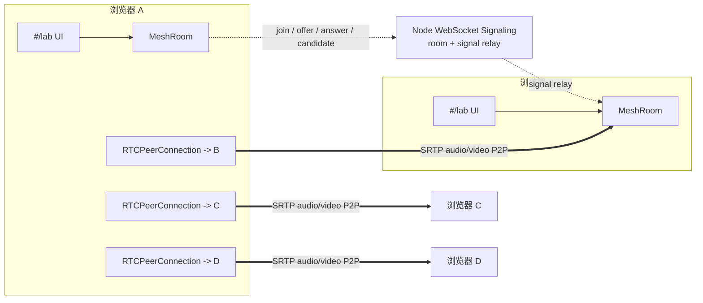
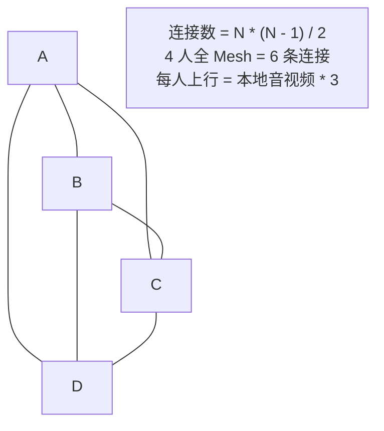
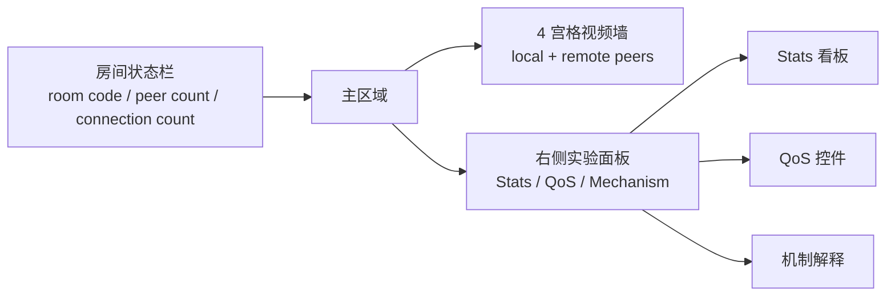

# WebRTC 教学实验台设计实施文档

## 1. 背景与目标

本实验台服务于《RTC 实时通信核心技术》课程，目标是在现有网页 slides 项目中提供一个可运行、可观测、可讲解的 WebRTC 实验入口。学生不只看到教材里的链路图和机制图，还能在浏览器里建立真实 P2P 音视频通话，观察 QoS/QoE 指标如何随参数变化而变化。

实验台采用集成式入口：保留现有 `#/slide/:n` 课程页面，同时提供 `#/lab`。默认面向本机多标签页演示，使用 Chrome/Edge，最多 4 人加入同一个房间，所有媒体都走浏览器之间的 P2P Mesh，不引入 SFU 或 MCU。工程中还提供独立 `#/quiz` 自测页面，用于课后检验学习成果。

核心目标：

- 建立最多 4 人全 P2P 音视频通话，让学生直观看到 Mesh 的连接数、上行码率和端侧编码压力。
- 将教材中的 QoS/QoE 概念映射为实时面板：RTT、丢包率、jitter、渲染帧率、码率、codec、NACK/PLI/FIR、concealment、jitterBufferDelay。
- 演示浏览器可以真实控制的参数，例如码率、帧率、缩放、音频前处理和 content hint。
- 对浏览器不可稳定硬控的机制，例如 NACK、FEC、PLC、jitter buffer，用实时 stats 观察和模拟解释呈现，不把它们描述成强制开关。

### 1.1 读者导航

这份文档同时服务三类人，阅读路径不同：

| 读者 | 先读 | 重点判断 |
|---|---|---|
| 实现者 | 第 3、4、5、6、7、9、14 节 | 模块边界、信令协议、Mesh 生命周期、Stats 口径是否足够明确 |
| 讲师 | 第 1、8、10、12、15 节 | 课堂演示是否顺手，学生能否从现象回到指标和机制 |
| 后续维护者 | 第 2、11、13、14、15 节 | 哪些能力故意不做，哪些浏览器差异要降级，完成定义是否清晰 |

维护时优先保护三条主线：房间成员状态、每个 peer 的连接生命周期、Stats 到 UI 的指标口径。只要这三条线保持清楚，后续增加 screen share、导出或 TURN 配置也不会把实验台变成难以理解的会议系统。

## 2. 范围与约束

### 2.1 本期范围

- 前端：在现有 React/Vite 应用中新增 `#/lab` 实验台。
- 信令：新增轻量 Node WebSocket 服务，只负责房间成员管理和 SDP/ICE 消息转发。
- 媒体：使用浏览器原生 WebRTC，最多 4 人全 Mesh P2P。
- 统计：按 peer 展示实时 stats，并提供房间级汇总。
- QoS：提供真实可调参数和教学模拟面板。
- UI：4 宫格视频墙、房间状态栏、右侧实验面板，延续当前课程视觉系统。

### 2.2 明确不做

- 不做 SFU、MCU、服务端录制或服务端媒体处理。
- 不默认配置 TURN，v1 只面向 localhost 课堂演示。
- 不做公网部署、鉴权、账号、持久化房间。
- 不做 stats 导出。本轮选择只看实时面板。
- 不做聊天、屏幕共享、白板或课件同步。
- 不做 4 人以上房间。
- 不做复杂自动重协商。codec preference 变化要求重启通话或重新入房。

### 2.3 浏览器与运行环境

- 目标浏览器：Chrome/Edge 优先。
- 目标地址：`http://localhost:5173/#/lab`。
- 推荐本地启动命令：`npm run dev:lab`，同时启动 Vite 客户端和 Node WebSocket 信令服务。
- 摄像头/麦克风权限：localhost 属于浏览器允许的安全上下文。
- 默认 ICE 配置：`iceServers: []`。本机多标签页和同机演示不依赖 STUN/TURN。
- 可选配置：通过 `VITE_SIGNALING_URL` 覆盖信令地址，默认 `ws://localhost:8787`。

## 3. 系统架构

实验台由三部分组成：React 前端、Node WebSocket 信令服务、浏览器之间的 WebRTC P2P 媒体连接。信令服务只转发消息，不接触音视频媒体。



### 3.1 前端职责

- 进入实验台、选择房间、采集本地音视频。
- 连接信令服务并维护房间成员列表。
- 为每个远端 peer 创建和关闭独立 `RTCPeerConnection`。
- 将本地 tracks 添加到每条 peer connection。
- 渲染本地和远端视频宫格。
- 周期性读取 `getStats()`，聚合为课堂可读指标。
- 将 QoS 控件应用到所有 active outbound senders。

### 3.2 信令服务职责

- 接收 peer join。
- 维护 `roomId -> peers`。
- 限制每个房间最多 4 人。
- 广播成员加入和离开。
- 按 `to` 字段转发 offer、answer、ICE candidate。
- 断开连接时清理 peer，并通知同房间其他成员。

### 3.3 媒体连接职责

媒体完全由浏览器端 WebRTC 处理。每一对参与者之间有独立 P2P 连接，不共享 `RTCPeerConnection`。

4 人房间时：

- 每个参与者维护 3 条 peer connection。
- 全房间共有 `N * (N - 1) / 2` 条 P2P 连接。
- 4 人时共有 6 条 P2P 连接。
- 每个参与者默认向 3 个远端发送音频和视频，上行压力随人数线性增加。



### 3.4 模块契约

为保持实现易维护，前端按“少数稳定契约 + 可替换内部实现”拆分。实现时不要让 UI 组件直接操作 WebSocket 或原始 `RTCPeerConnection`。

| 模块 | 输入 | 输出 | 不负责 |
|---|---|---|---|
| `signalingClient` | roomId、peerId、displayName、待发送信令 | 房间事件、定向 signal 事件、连接状态 | 不创建 peer connection，不解释 SDP |
| `meshRoom` | 本地媒体流、房间事件、QoS 状态 | peers、sessions、房间汇总状态、控制动作 | 不渲染 UI，不做 stats 公式 |
| `peerSession` | remote peer、local tracks、signal payload | remote stream、connection state、sender 列表 | 不管理房间容量，不处理其他 peer |
| `statsCollector` | peer session、上一帧 stats | `RtcStatsSnapshot` 和房间汇总 | 不直接修改 UI，不触发 QoS 控制 |
| `qosControls` | `QosControlState`、active senders、local tracks | 参数应用结果、unsupported reason | 不做教学文案，不采集 stats |
| UI components | room state、snapshots、control state | 用户操作事件、可视化反馈 | 不直接读写 WebSocket，不直接遍历 raw stats |

这个契约让复杂度集中在 `meshRoom` 和 `peerSession`，其余模块都可以独立测试或替换。UI 只消费整理后的状态，不依赖浏览器原始 report 的字段细节。

## 4. 信令协议

信令消息使用 JSON。服务端不理解 SDP 内容，只校验基本字段并转发。

### 4.1 Client -> Server

```ts
type JoinMessage = {
  type: "join";
  roomId: string;
  peerId: string;
  displayName: string;
};

type SignalMessage = {
  type: "signal";
  roomId: string;
  from: string;
  to: string;
  payload: {
    type: "offer" | "answer" | "candidate";
    description?: RTCSessionDescriptionInit;
    candidate?: RTCIceCandidateInit;
  };
};

type LeaveMessage = {
  type: "leave";
  roomId: string;
  peerId: string;
};
```

### 4.2 Server -> Client

```ts
type RoomMessage = {
  type: "room";
  roomId: string;
  peerId: string;
  maxPeers: 4;
  peers: Array<{
    peerId: string;
    displayName: string;
    joinedAt: number;
  }>;
};

type PeerJoinedMessage = {
  type: "peer-joined";
  peer: {
    peerId: string;
    displayName: string;
    joinedAt: number;
  };
};

type PeerLeftMessage = {
  type: "peer-left";
  peerId: string;
};

type RelayedSignalMessage = {
  type: "signal";
  from: string;
  payload: SignalMessage["payload"];
};

type ErrorMessage = {
  type: "error";
  code: "room-full" | "invalid-message" | "peer-not-found";
  message: string;
};
```

## 5. 多人 P2P Mesh 设计

### 5.1 核心对象

```ts
type MeshRoomState = {
  roomId: string;
  localPeer: PeerInfo;
  maxPeers: 4;
  peers: Map<string, PeerInfo>;
  sessions: Map<string, PeerSession>;
  aggregateStats: RoomStatsSnapshot;
};

type PeerSession = {
  peer: PeerInfo;
  pc: RTCPeerConnection;
  remoteStream: MediaStream;
  connectionState: RTCPeerConnectionState;
  iceConnectionState: RTCIceConnectionState;
  stats: RtcStatsSnapshot;
  polite: boolean;
};

type PeerInfo = {
  peerId: string;
  displayName: string;
  joinedAt: number;
};
```

### 5.2 入房流程

1. 用户打开 `#/lab`，输入或生成房间码。
2. 前端调用 `getUserMedia({ audio: true, video: true })`，拿到本地流。
3. 前端连接 WebSocket 并发送 `join`。
4. 服务端返回当前房间已有 peers。
5. 新加入者为每个已有 peer 创建 `PeerSession`，添加本地 tracks，并发起 offer。
6. 已有 peer 收到 offer 后创建对应 `PeerSession`，添加本地 tracks，设置 remote description，生成 answer。
7. 双方通过信令交换 ICE candidates。
8. `ontrack` 到达后更新对应远端视频 tile。

这个策略让“谁发起 offer”保持简单：新加入者向已有成员发起连接。v1 不做多人同时加入的复杂优化；若极端情况下发生 offer collision，可用 peerId 字典序作为 tie breaker，较小 peerId 为 polite peer。

### 5.3 离房与清理

当 peer 主动离开或 WebSocket 断开：

- 服务端从房间 peers 中移除该 peer。
- 服务端向剩余成员广播 `peer-left`。
- 前端关闭对应 `PeerSession.pc`。
- 停止 stats polling 中该 session 的采样。
- 从视频宫格和 stats 面板移除该 peer。

本地离开房间时：

- 发送 `leave`。
- 关闭所有 peer connections。
- 停止本地 tracks。
- 清空 room state。

### 5.4 媒体开关策略

为了避免多人重协商复杂化，v1 的麦克风和摄像头开关不 remove track：

- 静音：设置 audio track `enabled = false`。
- 开麦：设置 audio track `enabled = true`。
- 关摄像头：设置 video track `enabled = false`。
- 开摄像头：设置 video track `enabled = true`。

这样远端不需要 renegotiation，UI 只需根据 track enabled 状态显示静音/关摄像头。

## 6. Stats 与看板设计

Stats 模块每 1 秒对每个 active `RTCPeerConnection` 调用一次 `getStats()`，将浏览器原始 report 转成课堂可读的快照。不同浏览器和不同连接阶段字段可能缺失，所有指标都必须支持 `N/A`。

### 6.1 单 peer 指标

```ts
type RtcStatsSnapshot = {
  timestamp: number;
  connection: {
    state: RTCPeerConnectionState;
    iceState: RTCIceConnectionState;
    candidateType?: string;
    currentRoundTripTimeMs?: number;
    availableOutgoingBitrateKbps?: number;
  };
  outbound: {
    audioBitrateKbps?: number;
    videoBitrateKbps?: number;
    framesPerSecond?: number;
    frameWidth?: number;
    frameHeight?: number;
    packetsSent?: number;
    bytesSent?: number;
    nackCount?: number;
    pliCount?: number;
    firCount?: number;
    codec?: string;
  };
  inbound: {
    audioBitrateKbps?: number;
    videoBitrateKbps?: number;
    packetsReceived?: number;
    packetsLost?: number;
    packetLossRate?: number;
    jitterMs?: number;
    jitterBufferDelayMs?: number;
    framesDecoded?: number;
    framesPerSecond?: number;
    framesDropped?: number;
    freezeCount?: number;
    concealedSamples?: number;
    concealmentRate?: number;
    codec?: string;
  };
};
```

### 6.2 派生指标口径

- 码率：`8 * delta(bytesSent|bytesReceived) / deltaTime`。
- 丢包率：优先使用相邻两次 `getStats()` 的 `packetsLost` / `packetsReceived` 增量计算当前窗口；首帧或分母为 0 时显示 `N/A`，必要时才退回累计口径。
- 平均 jitter buffer delay：`jitterBufferDelay / jitterBufferEmittedCount`。
- 平均 RTT：优先使用 selected candidate pair 的 `currentRoundTripTime`，否则使用 remote inbound/outbound RTP report。
- FPS：优先使用 stats 中的 `framesPerSecond`，缺失时用 `delta(framesDecoded|framesSent) / deltaTime` 估算。
- codec：通过 RTP report 的 `codecId` 关联 codec report；若浏览器不暴露 `codecId`，退回 report 上的 `mimeType`。UI 只显示课堂可读的 codec 名称。

### 6.3 房间汇总

房间级看板展示：

- 当前人数：`1-4`。
- P2P 连接数：active sessions 数量。
- 理论 Mesh 连接数：`N * (N - 1) / 2`。
- 本端总上行码率：所有 outbound audio/video bitrate 之和。
- 本端总下行码率：所有 inbound audio/video bitrate 之和。
- 最差 RTT：所有 peer RTT 最大值。
- 最差丢包率：所有 peer packet loss rate 最大值。
- 平均渲染 FPS：所有 inbound video FPS 平均值。

## 7. QoS 控件与教学边界

### 7.1 真实控制项

真实控制项应直接作用到浏览器 API，并在 UI 中标注“真实控制”。

```ts
type QosControlState = {
  video: {
    maxBitrateKbps: number;
    maxFramerate: number;
    scaleResolutionDownBy: number;
    degradationPreference: "balanced" | "maintain-framerate" | "maintain-resolution";
    contentHint: "" | "motion" | "detail" | "text";
  };
  audio: {
    echoCancellation: boolean;
    noiseSuppression: boolean;
    autoGainControl: boolean;
  };
  codec: {
    preferredVideoCodec?: "VP8" | "H264" | "VP9" | "AV1";
    requiresRestart: boolean;
  };
};
```

应用规则：

- `maxBitrate`、`maxFramerate`、`scaleResolutionDownBy`、`degradationPreference`：对所有 active video `RTCRtpSender` 调用 `sender.setParameters()`。
- `contentHint`：设置本地 video track 的 `contentHint`。
- AEC/NS/AGC：通过重新采集音频 track 生效；替换到所有 active senders 时使用 `replaceTrack()`。
- codec preference：展示当前浏览器 `RTCRtpSender.getCapabilities("video")` 支持的 codec 列表；选择后通过 video transceiver `setCodecPreferences()` 影响下一次 offer/answer。已在通话中修改时提示需要离开并重新加入，v1 不做多人在线 codec renegotiation。

### 7.2 教学观察与模拟项

这些机制不作为浏览器强制开关实现，而作为“观察 + 模拟解释”呈现。

| 机制 | 真实可观察证据 | v1 呈现方式 | 说明 |
|---|---|---|---|
| NACK/RTX | `nackCount`、RTT、丢包率、恢复后的 freeze 变化 | 显示计数和 deadline 模拟 | 浏览器内部决定何时 NACK，应用不能稳定强制开关 |
| PLI/FIR | `pliCount`、`firCount`、关键帧码率尖峰 | 显示计数和关键帧风暴风险说明 | 不提供频繁触发按钮，避免误导和破坏连接 |
| FEC/RED | codec/SDP 能力、丢包下码率与恢复表现 | 冗余成本模拟滑块 | 浏览器实现和协商差异较大，不承诺强制启用 |
| PLC | `concealedSamples`、concealment rate | 音频 concealment 面板 | PLC 是接收端体验兜底，不是真正恢复网络包 |
| jitter buffer | `jitterBufferDelay`、`jitterBufferMinimumDelay`、freeze | 缓冲深度取舍模拟 | `jitterBufferTarget` 支持不稳定，能力检测后可只读或禁用 |

### 7.3 推荐 presets

- 基线：720p、24 fps、1200 kbps、balanced。
- 音频优先：视频 360p、15 fps、450 kbps，保留音频。
- 低码率：视频 300 kbps，观察清晰度、FPS 和 freeze 变化。
- 保帧率：`degradationPreference = "maintain-framerate"`，观察分辨率下降。
- 保清晰度：`degradationPreference = "maintain-resolution"`，观察 FPS 下降。
- 文本/课件：`contentHint = "detail"` 或 `"text"`，观察编码策略和带宽变化。

## 8. UI 方案

实验台采用“视频墙 + 实验面板”的工作台布局，避免做成营销页。



### 8.1 房间状态栏

- 房间码输入/复制。
- 本地显示名。
- 信令服务器地址输入，默认 `ws://localhost:8787`，加入房间前可改为局域网或部署后的 WebSocket 地址。
- 加入/离开按钮。
- 打开设备按钮：先触发浏览器摄像头/麦克风权限，再显示实验台内的设备选择弹窗；可在加入前选择设备，也可在已加入且处于 `demo`、`audio-only` 或 `video-only` 时重新选择设备并替换发送 track。
- 当前人数与容量：`3 / 4`。
- 当前 Mesh 连接数：例如 `3 条本端连接 / 6 条全房间连接`。
- 信令连接状态。
- 当前本地媒体模式：`camera`、`audio-only`、`video-only` 或 `demo`。

### 8.2 视频墙

- 最多 4 个固定 tile。
- 本地 tile 固定在第一个位置。
- 视频墙提供统一画幅拖拽控制，便于课堂演示 4:3、16:9、21:9 等窗口比例对布局和观感的影响。
- 每个远端 tile 显示 displayName、连接状态、静音/关摄像头状态。
- 远端 peer tile 内显示轻量指标：RTT、loss、FPS、codec；本地预览和空位不显示这些链路指标，避免误解。
- 空 tile 显示可加入容量，不做复杂占位装饰。

### 8.3 实验面板

使用 tabs 或 segmented control：

- Stats：单 peer 详情和房间汇总。
- Stats 面板展示 `chrome://webrtc-internals/` 地址并提供复制按钮，便于教师查看浏览器内部 WebRTC 原始指标。
- QoS：真实控制项和 presets。
- Mechanism：NACK/FEC/PLC/jitter buffer 的教学模拟与证据解释。

### 8.4 教学演示脚本

实验台第一屏要支持讲师按固定节奏演示。每一步都要有一个可见操作、一个指标证据和一个课程概念。

| 步骤 | 操作 | 观察指标 | 讲解点 |
|---|---|---|---|
| 1. 基线连通 | 打开两个标签页加入同一房间 | 首帧出现、RTT、codec、基础码率 | WebRTC 媒体路径和信令路径分离 |
| 2. Mesh 增长 | 加入第 3、4 个标签页 | 本端连接数从 1 到 3，全房间连接数到 6 | P2P Mesh 的上行和编码压力 |
| 3. 音频优先 | 应用“音频优先”preset | 视频码率/FPS 降低，音频保持 | 弱网先保语音连续性 |
| 4. 低码率 | 将视频码率降到 300 kbps | 清晰度下降、丢帧或 FPS 变化 | 编码器在带宽约束下做取舍 |
| 5. 保帧率/保清晰度 | 切换 degradation preference | 分辨率或 FPS 的不同变化 | 体验目标决定编码降级方向 |
| 6. 机制解释 | 打开 Mechanism tab，对照 NACK/PLC/jitter 指标 | `nackCount`、concealment、jitterBufferDelay | 区分真实控制项和浏览器内部恢复机制 |
| 7. 离开清理 | 关闭一个标签页 | tile 移除、连接数下降、stats 停止 | 生命周期清理和可观测性 |

如果课堂网络或摄像头资源不稳定，演示可以降级为 2 个标签页：先讲通话链路，再讲 QoS 控件和 stats 面板。4 人演示只用于说明 Mesh 成本，不作为每节课必须跑满的步骤。

从 slides 进入实验台有两个入口：直接访问 `#/lab`，或点击 slides 底部控制栏的 `Lab` 按钮。回到课程则点击实验台顶部的“返回课程”。

完成实验后，学生可以进入 `#/quiz` 做课程自测。Quiz 当前包含 70 道单选题和 10 道填空题，满分 100 分；提交后会展示总分、分项得分、章节得分、错题答案和解释。填空题会展示参考答案和原理解析，便于把 Lab 中观察到的 Stats 现象回扣到课程概念。

## 9. 实施步骤

### 9.1 信令服务

- 新增 `server/signaling.mjs`。
- 新增依赖 `ws`。
- 新增脚本：
  - `npm run signal`：启动 WebSocket 信令服务。
  - `npm run dev:lab`：并行启动 Vite 和信令服务。
- 实现 room map、join、leave、signal relay、disconnect cleanup。
- 房间最多 4 人，第五人返回 `room-full`。

### 9.2 前端路由与实验台入口

- 在 `App.tsx` 或轻量 router 中识别 `window.location.hash`。
- `#/lab` 渲染实验台。
- `#/slide/:n` 渲染现有 DeckShell。
- DeckShell 继续只处理 slide hash，不因 lab hash 重置到第一页。

### 9.3 MeshRoom 与 PeerSession

- 新增 hooks 或模块：
  - `useSignalingClient`
  - `useLocalMedia`
  - `useMeshRoom`
  - `createPeerSession`
- 每个 peer session 独立持有 pc、remote stream、状态和 stats。
- 新加入者向已有 peer 发 offer。
- 收到 offer 的已有 peer 创建 session 并 answer。
- ICE candidate 按 peer 定向转发。
- peer left 时关闭和移除 session。

### 9.4 媒体 UI

- 新增 `LabShell`。
- 新增 `VideoGrid`、`VideoTile`、`RoomBar`。
- 支持本地 mute/camera toggle。
- 使用固定宫格尺寸，避免视频加载或 stats 刷新导致布局跳动。

### 9.5 Stats 聚合

- 新增 `statsCollector`。
- 每个 session 每 1 秒采样。
- 保存上一帧 stats，用于计算 bitrate 和 FPS。
- 输出 `RtcStatsSnapshot`。
- 缺失字段统一输出 `undefined`，UI 展示 `N/A`。

### 9.6 QoS 面板

- 新增 `QosPanel`。
- presets 应用到所有 active video senders。
- 音频 AEC/NS/AGC 改动时重新采集音频 track 并 replace 到所有 senders。
- codec preference 设置 pending state，并在创建新的 peer session 时写入 video transceiver 的 codec preferences；通话中修改仍提示重新入房。
- Mechanism tab 展示 NACK/FEC/PLC/jitter buffer 的证据和模拟。

### 9.7 验收与收尾

- 跑 `npm run build`。
- 本机打开 2、3、4 个 Chrome/Edge 标签页验证入房。
- 验证第五个标签页被拒绝。
- 验证离开、刷新、关闭标签页的清理。
- 验证 QoS 控件对所有 outbound senders 生效。
- 验证 stats 缺失时 UI 不崩溃。

## 10. 测试验收清单

### 10.1 功能验收

- 两个标签页进入同一房间后，双方能看到和听到对方。
- 三个标签页进入同一房间后，每个端都能看到另外两端。
- 四个标签页进入同一房间后，每个端都能看到另外三端。
- 第五个标签页加入同一房间时，被明确拒绝并显示房间已满。
- 任一标签页离开后，其他标签页移除对应视频 tile。
- 刷新一个标签页后，旧连接被清理，新连接可重新建立。
- 本地静音/开麦不触发重协商，远端体验正确。
- 本地关摄像头/开摄像头不触发重协商，远端 tile 状态正确。

### 10.2 Stats 验收

- 每个远端 peer 都有独立 stats 卡片。
- RTT、loss、jitter、FPS、码率、codec 至少在稳定连接后能显示。
- `N/A` 字段不会造成 UI 报错。
- 房间汇总连接数符合 Mesh 公式。
- 码率变化能在 QoS 控件调整后数秒内反映。
- 断开一个 peer 后，该 peer stats polling 停止。

### 10.3 QoS 验收

- 调低 `maxBitrate` 后，outbound video bitrate 下降。
- 调低 `maxFramerate` 后，发送或接收 FPS 下降。
- 调大 `scaleResolutionDownBy` 后，分辨率或编码负载下降。
- 切换 `degradationPreference` 后，面板能解释保帧率和保清晰度的取舍。
- 改变 `contentHint` 后，UI 显示当前 hint。
- AEC/NS/AGC 切换后，新音频 track 能替换到所有 peer sessions。
- codec 选择显示为 pending，并提示需要重启通话；重新入房后 stats 中的 codec 应反映协商结果。

### 10.4 课堂验收

- 教师能用 4 个标签页演示 Mesh 连接数从 1、3、6 增长。
- 教师能演示每增加一个参与者，本端上行连接数增加 1。
- 学生能把“感觉卡顿”对应到 RTT、loss、jitterBufferDelay、FPS 或 concealment。
- 学生能说清哪些是浏览器真实控制项，哪些是内部机制的观察和模拟。

## 11. 风险与降级

| 风险 | 表现 | 降级策略 |
|---|---|---|
| 多标签页摄像头资源冲突 | 后加入标签页无法采集摄像头 | 允许只音频加入，或提示关闭其他标签页摄像头 |
| 机器没有摄像头/麦克风 | 浏览器返回 `Requested device not found` | 自动创建本地演示视频流并继续加入房间，状态栏显示 `demo`；教师可点击“打开设备”重新触发权限请求 |
| 字段浏览器不支持 | 某些 stats 一直为空 | 显示 `N/A`，机制解释不依赖单一字段 |
| 多人同时加入造成 offer collision | 连接状态卡住 | 使用 peerId tie breaker 和重试按钮 |
| 本机 CPU 压力高 | 4 人视频 FPS 下降 | 默认低码率，提供音频优先 preset |
| codec preference 在线变更复杂 | 多 peer renegotiation 失败 | v1 要求重启通话生效 |
| 学生误解内部机制为开关 | 以为 NACK/FEC/PLC 可随意启停 | UI 明确标注“观察/模拟”，不使用“开启 NACK”文案 |

## 12. 与课程内容的对应关系

- 第 12 页 QoS 与 QoE：实验台把 QoS 指标和 QoE 现象放在同一面板里观察。
- 第 20 页 P2P Mesh 架构：实验台用真实多人连接展示 Mesh 连接数和上行压力。
- 第 29 页带宽估计与拥塞控制：QoS 控件演示码率、帧率、分辨率调整。
- 第 30-35 页丢包恢复与 jitter buffer：机制面板用 stats 和模拟解释 NACK、FEC、PLC、jitter buffer。
- 第 42 页 getStats 与监控公式：Stats 聚合模块把原始 browser reports 转成课堂指标。
- 第 45-49 页代码与工程实践：实验台本身作为可运行实验材料和课堂作业基础。

## 13. 设计审查结论

按“易于维护、易于理解、便于演示和教学”复查后，设计保留当前低复杂度方向：最多 4 人、全 Mesh、localhost、Chrome/Edge 优先、真实控制和模拟解释并存。需要特别保护以下决策：

- 维护性：不要让 UI 直接操作 WebSocket、raw stats 或 `RTCPeerConnection`；通过第 3.4 节的模块契约隔离复杂度。
- 理解性：对学生只暴露“现象 -> 指标 -> 链路位置 -> 机制解释”的路径，不要求他们读浏览器原始 stats report。
- 演示性：课堂演示优先保证 2 标签页稳定，3/4 标签页用于展示 Mesh 成本；不要把 4 人跑满作为唯一成功路径。
- 真实性：`maxBitrate`、`maxFramerate`、`scaleResolutionDownBy`、AEC/NS/AGC 等标为真实控制；NACK/FEC/PLC/jitter buffer 标为观察或模拟。
- 可扩展性：后续增加 TURN、screen share、stats 导出时，应新增模块或面板，不改动 Mesh 生命周期和 stats 口径主线。

## 14. 建议文件结构

```text
server/
  signaling.mjs

src/
  lab/
    LabShell.tsx
    RoomBar.tsx
    VideoGrid.tsx
    VideoTile.tsx
    StatsPanel.tsx
    QosPanel.tsx
    MechanismPanel.tsx
    signalingClient.ts
    meshRoom.ts
    peerSession.ts
    statsCollector.ts
    qosControls.ts
    types.ts
```

文件结构可按实现时的代码体量调整，但模块边界应保持：信令、Mesh 管理、单 peer session、stats 聚合、QoS 控制、UI 展示分离。

## 15. 完成定义

本实验台完成的标准不是“页面能打开”，而是：

- 4 人以内全 Mesh P2P 音视频可运行。
- 连接数、码率、RTT、loss、FPS、codec 等指标可观察。
- QoS 控件能真实影响浏览器可控参数。
- 浏览器内部机制不被误写成应用层硬开关。
- 课堂上能用它解释教材中的 Mesh、QoS/QoE、getStats、弱网恢复和编码取舍。
